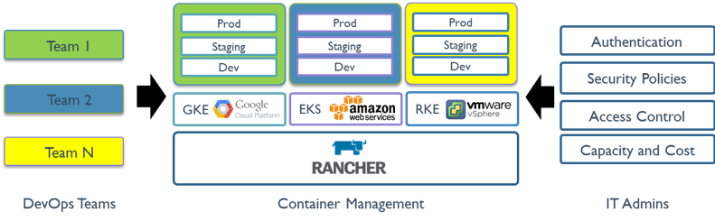

##概述
###What’s Rancher？
Rancher是一套容器管理平台，它可以帮助组织在生产环境中轻松快捷的部署和管理容器。 Rancher可以轻松地管理各种环境的Kubernetes，满足IT需求并为DevOps团队提供支持。

Kubernetes不仅已经成为的容器编排标准，它也正在迅速成为各类云和虚拟化厂商提供的标准基础架构。Rancher用户可以选择使用Rancher Kubernetes Engine(RKE)创建Kubernetes集群，也可以使用GKE，AKS和EKS等云Kubernetes服务。 Rancher用户还可以导入和管理现有的Kubernetes集群。

Rancher支持各类集中式身份验证系统来管理Kubernetes集群。例如，大型企业的员工可以使用其公司Active Directory凭证访问GKE中的Kubernetes集群。IT管​​理员可以在用户，组，项目，集群和云中设置访问控制和安全策略。 IT管​​理员可以在单个页面对所有Kubernetes集群的健康状况和容量进行监控。

Rancher为DevOps工程师提供了一个直观的用户界面来管理他们的服务容器，用户不需要深入了解Kubernetes概念就可以开始使用Rancher。 Rancher包含应用商店，支持一键式部署Helm和Compose模板。Rancher通过各种云、本地生态系统产品认证，其中包括安全工具，监控系统，容器仓库以及存储和网络驱动程序。下图说明了Rancher在IT和DevOps组织中扮演的角色。每个团队都会在他们选择的公共云或私有云上部署应用程序。

###What’s New？
早期的Rancher1.X版本是基于Docker以Cattle为调度引擎的容器管理平台。在Rancher1.X成功和经验的基础上，基于Kubernetes基础上重新设计Rancher2.0版本。 Rancher2.0保留了1.6版的友好功能，如UI和应用商店。但是，2.0包含许多新功能，例如:

- 内置CI/CD;

- 告警和日志收集;

- 多集群管理;

- Rancher Kubernetes Engine (RKE);

- 与云Kubernetes服务(如GKE，EKS和AKS)集成;