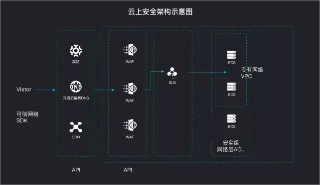

#DDoS攻击简介
分布式拒绝服务攻击（DDoS攻击）是一种针对目标系统的恶意网络攻击行为，DDoS攻击经常会导致被攻击者的业务无法正常访问，也就是所谓的拒绝服务。

常见的DDoS攻击包括以下几类：

- 网络层攻击：比较典型的攻击类型是UDP反射攻击，这类攻击主要利用大流量拥塞被攻击者的网络带宽，导致被攻击者的业务无法正常响应客户访问。

- 连接层攻击：比较典型的攻击类型包括SYN flood攻击、连接数攻击等，这类攻击通过占用服务器的连接池资源从而达到拒绝服务的目的。

- 会话层攻击：比较典型的攻击类型是SSL连接攻击，这类攻击占用服务器的SSL会话资源从而达到拒绝服务的目的。

- 应用层攻击：比较典型的攻击类型包括DNS flood攻击、HTTP flood攻击、游戏假人攻击等，这类攻击占用服务器的应用处理资源极大的消耗服务器处理性能从而达到拒绝服务的目的。

#DDoS攻击缓解最佳实践
建议阿里云用户从以下几个方面着手缓解DDoS攻击的威胁：

1. 缩小暴露面，隔离资源和不相关的业务，降低被攻击的风险。

2. 优化业务架构，利用公共云的特性设计弹性伸缩和灾备切换的系统。

3. 服务器安全加固，提升服务器自身的连接数等性能。

4. 做好业务监控和应急响应。

5. 选择合适的商业安全方案。阿里云既提供了免费的基础DDoS防护，也提供了BGP防护包、高防IP、游戏盾等商业安全方案，用户也可以选择其他厂商的安全方案。

##1. 缩小暴露面
###1.1 配置安全组
尽量避免将非业务必须的端口暴露在公网上，从而避免与业务无关的请求和访问。通过配置安全组可以有效防止系统被扫描或者意外暴露。

关于安全组的详细介绍，请查看[安全组使用指南](https://help.aliyun.com/knowledge_list/25467.html?spm=5176.7765932.2.3.ERA5SA)。

###1.2 使用专有网络（VPC）
通过专有网络VPC实现网络内部逻辑隔离，防止来自内网肉鸡的攻击。

关于专有网络VPC的详细介绍，请查看[专有网络VPC使用指南](https://help.aliyun.com/product/27706.html?spm=5176.7765932.2.4.ERA5SA)。

##2. 优化业务架构
###2.1 部署负载均衡
通过部署负载均衡（SLB）实例来负载多台服务器的方式，可以有效缓解一定流量范围内的连接层DDoS攻击。

同时，部署负载均衡方案后，也能将用户访问流量均衡分配到各个服务器上，减少单台服务器的负担，加快访问速度。

关于负载均衡（SLB）的详细介绍，请查看[负载均衡使用指南](https://help.aliyun.com/product/27537.html?spm=5176.7765932.2.5.ERA5SA)。

###2.2 部署弹性伸缩
弹性伸缩（Auto Scaling），是根据用户的业务需求和策略，经济地自动调整弹性计算资源的管理服务。通过部署弹性伸缩，系统可以有效的缓解会话层和应用层攻击，在遭受攻击时自动增加服务器，提升处理性能，避免业务遭受严重影响。

关于弹性伸缩的详细介绍，请查看[弹性伸缩使用指南](https://help.aliyun.com/product/25855.html?spm=5176.7765932.2.6.ERA5SA)。

###2.3 部署DNS智能解析
通过智能解析的方式优化DNS解析，可以有效避免DNS流量攻击产生的风险。同时，建议您将业务托管至多家DNS服务商。

- 屏蔽未经请求发送的DNS响应信息
- 丢弃快速重传数据包
- 启用TTL
- 丢弃未知来源的DNS查询请求和响应数据
- 丢弃未经请求或突发的DNS请求
- 启动DNS客户端验证
- 对响应信息进行缓存处理
- 使用ACL的权限
- 利用ACL，BCP38及IP信誉功能

###2.4 提供余量带宽
通过服务器性能测试，评估正常业务环境下所能承受的带宽和请求数。在购买带宽时确保有一定的余量带宽，可以避免遭受攻击时带宽大于正常使用量而影响正常用户的情况。

##3. 服务器安全加固
对服务器进行安全加固，减少可被攻击的点，增大攻击方的攻击成本：

- 确保服务器的系统文件是最新的版本，并及时更新系统补丁。
- 对所有服务器主机进行检查，清楚访问者的来源。
- 过滤不必要的服务和端口。例如，对于WWW服务器，只开放80端口，将其他所有端口关闭，或在防火墙上设置阻止策略。
- 限制同时打开的SYN半连接数目，缩短SYN半连接的timeout时间，限制SYN/ICMP流量。
- 仔细检查网络设备和服务器系统的日志。一旦出现漏洞或是时间变更，则说明服务器可能遭到了攻击。
- 限制在防火墙外进行网络文件共享。降低黑客截取系统文件的机会，若黑客以特洛伊木马替换它，文件传输功能将会陷入瘫痪。
- 充分利用网络设备保护网络资源。在配置路由器时应考虑针对流控、包过滤、半连接超时、垃圾包丢弃、来源伪造的数据包丢弃、SYN阀值、禁用ICMP和UDP广播的策略配置。
- 通过iptable之类的软件防火墙限制疑似恶意IP的TCP新建连接，限制疑似恶意IP的连接、传输速率。

##4. 业务监控和应急响应
###4.1 关注基础DDoS防护监控
当您的业务遭受DDoS攻击时，基础DDoS默认会通过短信和邮件方式发出告警信息，针对大流量攻击基础DDoS防护也支持电话报警，建议您在接受到告警的第一时间进行应急处理。

关于配置告警消息接收人和语音告警方式，请查看[DDoS基础防护消息接收人设置](https://help.aliyun.com/document_detail/50426.html?spm=5176.7765932.2.7.ERA5SA)。

###4.2 云监控
云监控服务可用于收集、获取阿里云资源的监控指标或用户自定义的监控指标，探测服务的可用性，并支持针对指标设置警报。

关于云监控的详细介绍，请查看[云监控用户指南](https://help.aliyun.com/product/28572.html?spm=5176.7765932.2.8.ERA5SA)。

##5. 商用安全方案
###5.1 Web应用防火墙（WAF）
针对网站类应用，WAF可以提供针对连接层攻击、会话层攻击和应用层攻击的有效防御。

关于WAF的详细介绍，请查看[WAF用户指南](https://help.aliyun.com/product/28515.html?spm=5176.7765932.2.9.ERA5SA)。

###5.2 DDoS防护包
DDoS防护包为云产品IP提供防御100G以内的DDoS攻击的防护能力，配置简单，即时生效。

关于DDoS防护包的详细介绍，请查看DDoS防护包用户指南。

###5.3 高防IP
针对大流量DDoS攻击，建议使用阿里云高防IP服务。

关于高防IP的详细介绍，请查看[DDoS高防IP用户指南](https://help.aliyun.com/product/28461.html?spm=5176.7765932.2.11.ERA5SA)。

###5.4 游戏盾
游戏盾是针对游戏行业常见的DDoS攻击、CC攻击推出的行业解决方案。相比于高防IP服务，游戏盾解决方案的针对性更强，针对游戏行业的攻击防御效果更好、成本更低。

关于游戏盾的详细介绍，请查看[游戏盾用户指南](https://help.aliyun.com/product/65031.html?spm=5176.7765932.2.12.ERA5SA)。

#应当避免的事项
DDoS攻击是业内公认的行业公敌，DDoS攻击不仅影响被攻击者，同时也会对服务商网络的稳定性造成影响，从而对处于同一网络下的其他用户业务也会造成损失。

计算机网络是一个共享环境，需要多方共同维护稳定，部分行为可能会给整体网络和其他租户的网络带来影响，需要您注意：

- 避免使用阿里云产品机制搭建DDoS防护平台
- 避免释放处于黑洞状态的实例
- 避免为处于黑洞状态的服务器连续更换、解绑、增加SLB IP、弹性公网IP、NAT网关等IP类产品
- 避免通过搭建IP池进行防御，避免通过分摊攻击流量到大量IP上进行防御
- 避免利用阿里云非网络安全防御产品（包括但不限于CDN、OSS），前置自身有攻击的业务
- 避免使用多个账号的方式绕过上述规则