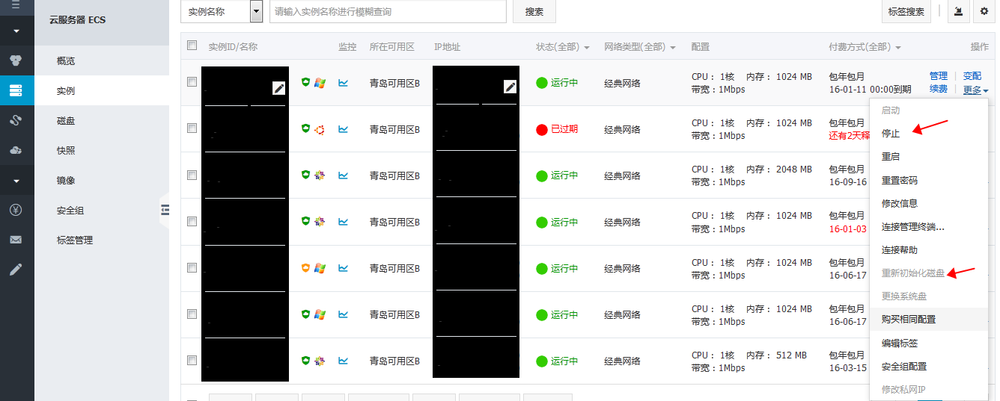

#操作系统安全加固

1.重置ECS实例。

注意：强烈建议您重置ECS实例前，备份您的数据。ECS实例重置完成后，对数据进行杀毒后再上传至ECS实例。

i. 登录ECS管理控制台，单击实例。
ii. 选择您的ECS实例，在更多下拉菜单中单击停止（如果您的实例当前为启动状态）。
iii. 实例停止后，在更多下拉菜单中单击重新初始化磁盘。
iv. 重新初始化磁盘完成后，操作系统将恢复回新购时的状态。

2.主机登录安全设置。

i. 建议修改默认的登录端口（RDP、SSH）为其它端口。
ii. 建议使用证书登录，设置可信登录主机的IP。
iii. 如果您需要使用密码登录，请务必使用复杂密码（字母+数字+特殊符号，包含大小写，并保证10位及以上字符）。
iv. 登录用户的权限使用普通用户权限，需要管理员权限时再进行提权。（Windows使用runas，linux使用sudo）

更多操作系统加固方法，请查看：

- [Windows操作系统安全加固](https://help.aliyun.com/document_detail/49781.html?spm=5176.7737538.2.4.3NwSTM)
- [Linux操作系统加固](https://help.aliyun.com/document_detail/49809.html?spm=5176.7737538.2.5.3NwSTM)

#应用服务软件安全部署

##常见Web应用安全部署设置
1.WDCP、TOMCAT、Apache、Nginx、Jekins、PHPMyAdmin、WebLogic、Jboss等Web服务管理后台不要使用默认密码或空密码，务必使用复杂密码（字母+数字+特殊符号，包含大小写，并保证10位及以上字符）；不使用的管理后台建议直接关闭，否则黑客有可能直接控制您的ECS服务器。

2.保证Web应用升级到最新版本，如Struts、ElasticSearch非最新版都爆发过远程命令执行漏洞。务必及时更新Web应用版本，否则黑客有可能直接控制您的ECS服务器。

3.Redis、Memcached、MongoDB如设置无密码访问，可导致黑客直接远程登录并控制您的服务器。请务必设置为有密码访问，并使用复杂密码。另外，建议修改端口并设置绑定监听IP为127.0.0.1。

##常见数据库应用安全部署设置

- Postgresql、Oracle、MySQL、SQLServer等默认连接端口建议修改为非常用端口。

- 根据不同的角色创建不同的账号，并精细化授权。切忌共享使用账号或使用系统账号登录数据库。

- 数据库连接密码使用复杂密码（字母+数字+特殊符号，包含大小写，并保证10位及以上字符）。

##其它
- 请及时升级各种应用，以免安全漏洞被黑客利用入侵服务器。
- 安装云盾安全防护软件，做好杀毒防护工作。