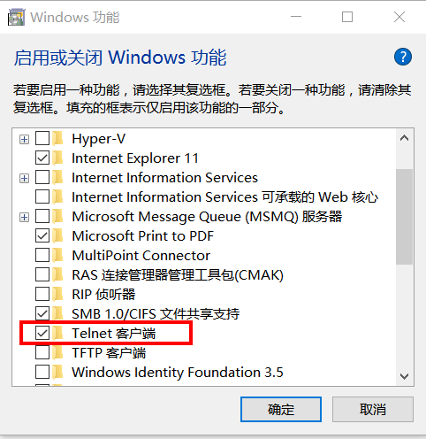
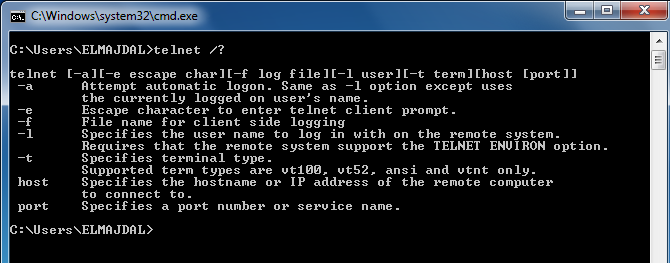

Telnet 是一款功能全面的端口测试工具，常用于网络管理和服务器调试。但是，Windows 操作系统默认未安装该功能。本文介绍了在 Windows 中安装 Telnet Client 的方法。

#使用命令行安装
以管理员的身份打开 cmd 窗口（win + R），执行下面的命令：

```
dism /online /Enable-Feature /FeatureName:TelnetClient
```

#在窗口模式下开启

1. 打开 控制面板 > 程序 > 启用或关闭 Windows 功能。

2. 勾选 Telnet 客户端 选项。


3. 单击 确定，等待安装完毕。
