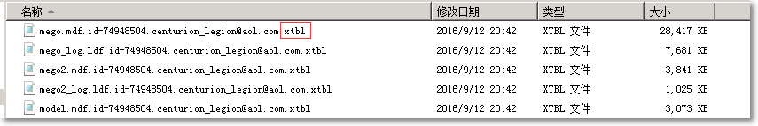
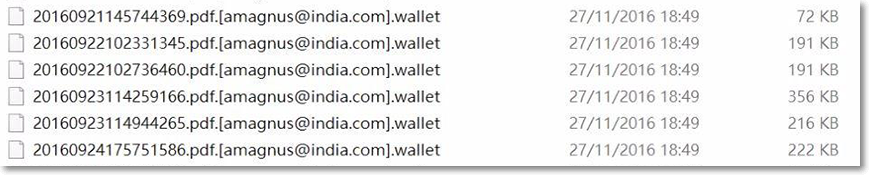

勒索软件是一种恶意软件（木马或其他类型的病毒），它能锁定用户设备或加密用户文件，然后通知用户必须支付赎金才能拿回自己的数据。所要求赎金一般很高昂，且不能保证一定可以成功解密。

如果在您的系统中存在文件被恶意加密或者有勒索信息，说明该系统感染了勒索软件。目前已知的勒索软件多数是通过邮件进行传播，本文提供了相应的解决方案。

#拒绝交付赎金
如果您的业务不幸遭遇密勒索软件，建议您不要向勒索者交付赎金以恢复数据。

#恢复数据
在文件被恶意加密时，您可以尝试通过之前的备份恢复数据。如果没有额外的数据备份，您可以使用安全厂商发布的工具集尝试解密数据。

注意：随着加密勒索软件对抗的不断升级，加密勒索软件可以在很短的时间内出现变种，使用工具不一定保障数据能够恢复成功。

##解密工具
作为安全厂商，卡巴斯基实验室破解了世界上大部分勒索病毒，更多勒索软件破解器请随时关注：

- [卡巴斯基：勒索软件解密工具集](https://noransom.kaspersky.com/?spm=5176.7750358.2.3.EqcOGT)
- [Trendmicro：勒索软件解密方案](https://esupport.trendmicro.com/solution/zh-cn/1115118.aspx?spm=5176.7750358.2.4.EqcOGT)
- [Avast：勒索软件解密工具集](https://www.avast.com/zh-cn/ransomware-decryption-tools?spm=5176.7750358.2.5.EqcOGT)

#XTBL 和 Wallet 加密勒索软件

以下举例说明常见的 XTBL 和 Wallet 加密勒索软件。

病毒名称：XTBL（可以解密），Wallet（暂时无法解密）

病毒类型：勒索病毒

勒索动机：黑客勒索受利益驱使，不接受现金，使用 bitcoin 进行勒索交易。

利用手法：使用 AES 或 RSA 算法，批量加密上百种后缀文件类型或者应用程序，并且把原来的文件名后缀为：xxxxx@aol.com、xxxxx@india.com.wallet。

危险等级：高危

入侵手段：远程控制协议漏洞（RDP 弱口令）、远程密码泄露，或其他升级演变的入侵方式。

病毒特征：黑客会在所有被加密文件上留下其联系方式。

- XTBL 病毒感染样例：

- WALLET 病毒感染样例：

破解工具：[XTBL 解密工具](http://docs-aliyun.cn-hangzhou.oss.aliyun-inc.com/assets/attach/50358/cn_zh/1486603044707/rannohdecryptor.zip?spm=5176.7750358.2.6.EqcOGT&file=rannohdecryptor.zip)

#数据恢复安全规范
- 建议重新部署系统或回滚之前正常状态的快照，并对操作系统和业务代码进行安全加固。

- 修改所有管理端口的账号和密码，并配置强口令。建议使用 安全组策略 限制访问，并禁止将管理端口和管理后台开放到互联网，仅开放必要的业务端口。

- 数据恢复完毕后，立即对 ECS 配置定期快照策略，同时做好异地数据备份工作。

- 对业务作全面的安全检查，及时修复发现的漏洞。如果您没有专业的技术人员，可以选用阿里云云盾 安全管家服务 协助您对业务进行排查和加固。

了解更多：[企业用户应该如何抵御加密勒索事件？](https://bbs.aliyun.com/read/304556.html?spm=5176.7750358.2.9.EqcOGT)

#数据安全防范措施
- 备份重要文档。备份的最佳做法是采取 “3-2-1 规则”，即至少做三个副本，用两种不同格式保存，并将副本放在异地存储。如果有条件，建议全量备份，如数据量过大，可以选择不定期的实时全量和增量备份混合方案，推荐您使用快照和异地备份方案。

- 如果需要远程管理，可以使用防火墙来限制访问。把 RDP、SSH、FTP 或其他重要内网管理后台隐藏起来，仅限于内网访问，降低暴露在互联网被攻击的风险。

- 安装企业级防病毒软件。推荐您使用赛门铁克、卡巴斯基商用防病毒软件，Linux 服务器可以安装 Clam。

- 安装最新版本的安全补丁。过时的操作系统或软件相对容易成为勒索软件的攻击目标，因此，定期运行软件及操作系统可强化你电脑的安全性。

- 恶意软件经常将使用远程桌面协议（Remote Desktop Protocol, RDP）的系统作为主要目标。因此，不需要远程访问时就停用 RDP，可以有效阻挡来自恶意软件的攻击。

 - 配置好密码策略。
 - 修改远程控制账户密码，妥善管理密码。
 - 定期更新管理员账号名称和密码的更新策略。

- 提高安全意识，做好数据安全防护措施。

了解更多：[加密勒索事件防护方案](https://help.aliyun.com/document_detail/48701.html?spm=5176.7750358.2.10.EqcOGT)