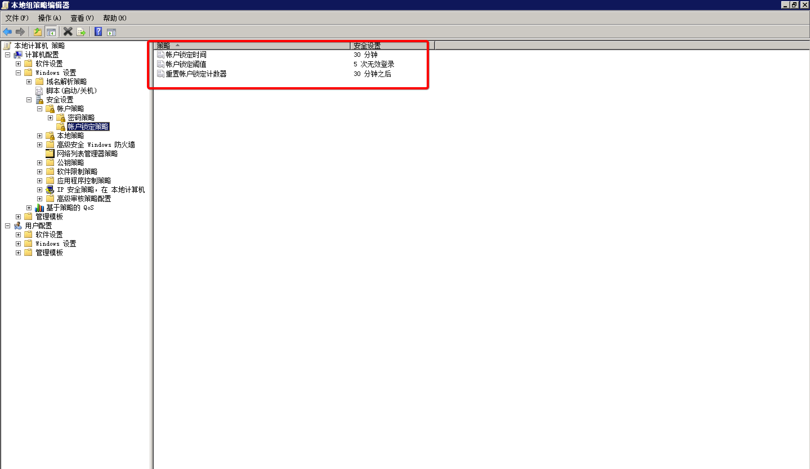
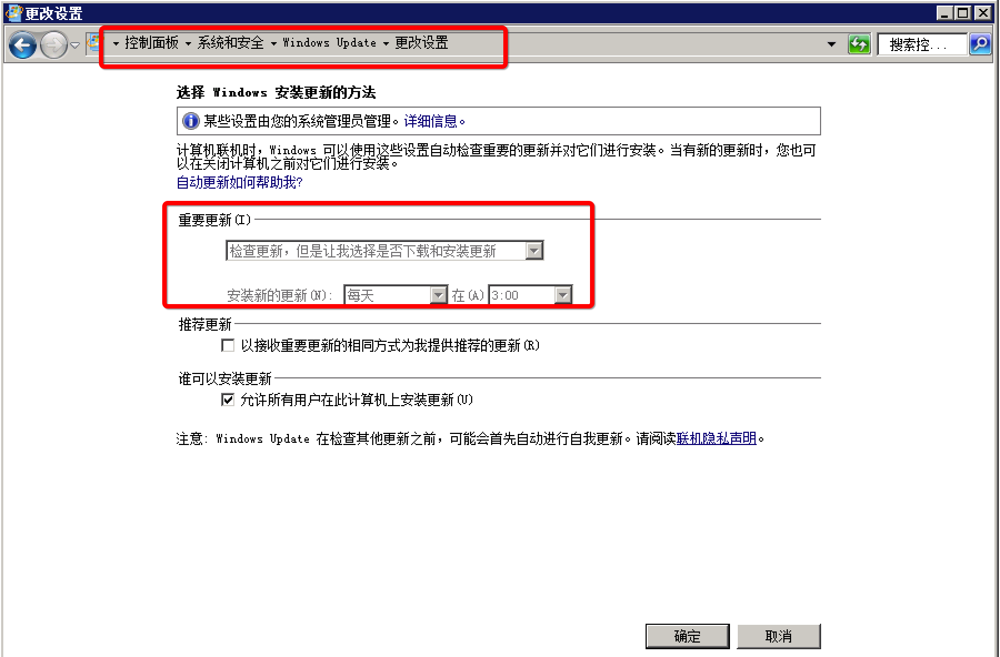

本文档旨在指导系统管理人员或安全检查人员进行Windows操作系统的安全合规性检查和配置。

#1. 账户管理和认证授权

1.1 账户

默认账户安全

- 禁用Guest账户。
- 禁用或删除其他无用账户（建议先禁用账户三个月，待确认没有问题后删除。）

操作步骤

打开 控制面板 > 管理工具 > 计算机管理，在 系统工具 > 本地用户和组 > 用户 中，双击 Guest 帐户，在属性中选中 帐户已禁用，单击 确定。

按照用户分配帐户

按照用户分配帐户。根据业务要求，设定不同的用户和用户组。例如，管理员用户，数据库用户，审计用户，来宾用户等。

操作步骤

打开 控制面板 > 管理工具 > 计算机管理，在 系统工具 > 本地用户和组 中，根据您的业务要求设定不同的用户和用户组，包括管理员用户、数据库用户、审计用户、来宾用户等。

定期检查并删除与无关帐户

定期删除或锁定与设备运行、维护等与工作无关的帐户。

操作步骤

打开 控制面板 > 管理工具 > 计算机管理，在 系统工具 > 本地用户和组 中，删除或锁定与设备运行、维护等与工作无关的帐户。

不显示最后的用户名

配置登录登出后，不显示用户名称。

操作步骤：

打开 控制面板 > 管理工具 > 本地安全策略，在 本地策略 > 安全选项 中，双击 交互式登录:不显示最后的用户名，选择 已启用 并单击 确定。


1.2 口令

密码复杂度

密码复杂度要求必须满足以下策略：

- 最短密码长度要求八个字符。
- 启用本机组策略中密码必须符合复杂性要求的策略。
  即密码至少包含以下四种类别的字符中的两种：
  - 英语大写字母 A, B, C, … Z
  - 英语小写字母 a, b, c, … z
  - 西方阿拉伯数字 0, 1, 2, … 9
  - 非字母数字字符，如标点符号，@, #, $, %, &, *等

操作步骤

打开 控制面板 > 管理工具 > 本地安全策略，在 帐户策略 > 密码策略 中，确认 密码必须符合复杂性要求 策略已启用。

密码最长留存期

对于采用静态口令认证技术的设备，帐户口令的留存期不应长于90天。

操作步骤打开 控制面板 > 管理工具 > 本地安全策略，在 帐户策略 > 密码策略 中，配置 密码最长使用期限 不大于90天。


帐户锁定策略

对于采用静态口令认证技术的设备，应配置当用户连续认证失败次数超过10次后，锁定该用户使用的帐户。

操作步骤

打开 控制面板 > 管理工具 > 本地安全策略，在 帐户策略 > 帐户锁定策略 中，配置 帐户锁定阈值 不大于10次。

配置样例：



1.3 授权

远程关机

在本地安全设置中，从远端系统强制关机权限只分配给Administrators组。

操作步骤

打开 控制面板 > 管理工具 > 本地安全策略，在 本地策略 > 用户权限分配 中，配置 从远端系统强制关机 权限只分配给Administrators组。

本地关机

在本地安全设置中关闭系统权限只分配给Administrators组。

操作步骤

打开 控制面板 > 管理工具 > 本地安全策略，在 本地策略 > 用户权限分配 中，配置 关闭系统 权限只分配给Administrators组。

用户权限指派

在本地安全设置中，取得文件或其它对象的所有权权限只分配给Administrators组。

操作步骤

打开 控制面板 > 管理工具 > 本地安全策略，在 本地策略 > 用户权限分配 中，配置 取得文件或其它对象的所有权 权限只分配给Administrators组。

授权帐户登陆

在本地安全设置中，配置指定授权用户允许本地登陆此计算机。

操作步骤

打开 控制面板 > 管理工具 > 本地安全策略，在 本地策略 > 用户权限分配 中，配置 允许本地登录 权限给指定授权用户。

授权帐户从网络访问

在本地安全设置中，只允许授权帐号从网络访问（包括网络共享等，但不包括终端服务）此计算机。

操作步骤

打开 控制面板 > 管理工具 > 本地安全策略，在 本地策略 > 用户权限分配 中，配置 从网络访问此计算机 权限给指定授权用户。


#2. 日志配置操作

2.1 日志配置

审核登录

设备应配置日志功能，对用户登录进行记录。记录内容包括用户登录使用的帐户、登录是否成功、登录时间、以及远程登录时、及用户使用的IP地址。

操作步骤

打开 控制面板 > 管理工具 > 本地安全策略，在 本地策略 > 审核策略 中，设置 审核登录事件。

审核策略

启用本地安全策略中对Windows系统的审核策略更改，成功和失败操作都需要审核。

操作步骤

打开 控制面板 > 管理工具 > 本地安全策略，在 本地策略 > 审核策略 中，设置 审核策略更改。

审核对象访问

启用本地安全策略中对Windows系统的审核对象访问，成功和失败操作都需要审核。

操作步骤

打开 控制面板 > 管理工具 > 本地安全策略，在 本地策略 > 审核策略 中，设置 审核对象访问。

审核事件目录服务访问

启用本地安全策略中对Windows系统的审核目录服务访问，仅需要审核失败操作。

操作步骤

打开 控制面板 > 管理工具 > 本地安全策略，在 本地策略 > 审核策略 中，设置 审核目录服务器访问。

审核特权使用

启用本地安全策略中对Windows系统的审核特权使用，成功和失败操作都需要审核。

操作步骤

打开 控制面板 > 管理工具 > 本地安全策略，在 本地策略 > 审核策略 中，设置 审核特权使用。

审核系统事件

启用本地安全策略中对Windows系统的审核系统事件，成功和失败操作都需要审核。

操作步骤

打开 控制面板 > 管理工具 > 本地安全策略，在 本地策略 > 审核策略 中，设置 审核系统事件。

审核帐户管理

启用本地安全策略中对Windows系统的审核帐户管理，成功和失败操作都要审核。

操作步骤

打开 控制面板 > 管理工具 > 本地安全策略，在 本地策略 > 审核策略 中，设置 审核帐户管理。

审核过程追踪

启用本地安全策略中对Windows系统的审核进程追踪，仅失败操作需要审核。

操作步骤

打开 控制面板 > 管理工具 > 本地安全策略，在 本地策略 > 审核策略 中，设置 审核进程追踪。


日志文件大小

设置应用日志文件大小至少为 8192 KB，可根据磁盘空间配置日志文件大小，记录的日志越多越好。并设置当达到最大的日志尺寸时，按需要轮询记录日志。

操作步骤

打开 控制面板 > 管理工具 > 事件查看器，配置 应用日志、系统日志、安全日志 属性中的日志大小，以及设置当达到最大的日志尺寸时的相应策略。


#3. IP协议安全配置

3.1 IP协议安全

启用SYN攻击保护

启用SYN攻击保护。

- 指定触发SYN洪水攻击保护所必须超过的TCP连接请求数阈值为5。
- 指定处于 SYN_RCVD 状态的 TCP 连接数的阈值为500。
- 指定处于至少已发送一次重传的 SYN_RCVD 状态中的 TCP 连接数的阈值为400。

操作步骤

打开 注册表编辑器，根据推荐值修改注册表键值。

Windows Server 2012

```
HKEY_LOCAL_MACHINE\SYSTEM\CurrentControlSet\Services\Tcpip\Parameters\SynAttackProtect
推荐值：2
HKEY_LOCAL_MACHINE\SYSTEM\CurrentControlSet\Services\Tcpip\Parameters\TcpMaxHalfOpen
推荐值：500
```

Windows Server 2008

```
HKEY_LOCAL_MACHINE\SYSTEM\CurrentControlSet\Services\SynAttackProtect
推荐值：2
HKEY_LOCAL_MACHINE\SYSTEM\CurrentControlSet\Services\TcpMaxPortsExhausted
推荐值：5
HKEY_LOCAL_MACHINE\SYSTEM\CurrentControlSet\Services\TcpMaxHalfOpen
推荐值：500
HKEY_LOCAL_MACHINE\SYSTEM\CurrentControlSet\Services\TcpMaxHalfOpenRetried
推荐值：400
```

#4. 文件权限

4.1 共享文件夹及访问权限

关闭默认共享

非域环境中，关闭Windows硬盘默认共享，例如C$，D$。

操作步骤

打开 注册表编辑器，根据推荐值修改注册表键值。

注意： Windows Server 2012版本已默认关闭Windows硬盘默认共享，且没有该注册表键值。

HKLM\System\CurrentControlSet\Services\LanmanServer\Parameters\AutoShareServer
推荐值： 0

共享文件夹授权访问

每个共享文件夹的共享权限，只允许授权的帐户拥有共享此文件夹的权限。

操作步骤

每个共享文件夹的共享权限仅限于业务需要，不要设置成为 Everyone。打开 控制面板 > 管理工具 > 计算机管理，在 共享文件夹 中，查看每个共享文件夹的共享权限。

#5. 服务安全

5.1 禁用TCP/IP上的NetBIOS

禁用TCP/IP上的NetBIOS协议，可以关闭监听的 UDP 137（netbios-ns）、UDP 138（netbios-dgm）以及 TCP 139（netbios-ssn）端口。

操作步骤

在 计算机管理 > 服务和应用程序 > 服务 中禁用 TCP/IP NetBIOS Helper 服务。
在网络连接属性中，双击 Internet协议版本4（TCP/IPv4），单击 高级。在 WINS 页签中，进行如下设置：


禁用不必要的服务

禁用不必要的服务，请参考：


#6.安全选项

6.1 启用安全选项

操作步骤

打开 控制面板 > 管理工具 > 本地安全策略，在 本地策略 > 安全选项 中，进行如下设置：


6.2 禁用未登录前关机

服务器默认是禁止在未登录系统前关机的。如果启用此设置，服务器安全性将会大大降低，给远程连接的黑客造成可乘之机，强烈建议禁用未登录前关机功能。

操作步骤

打开 控制面板 > 管理工具 > 本地安全策略，在 本地策略 > 安全选项 中，禁用 关机: 允许系统在未登录前关机 策略。


#7. 其他安全配置

7.1 防病毒管理

Windows系统需要安装防病毒软件。

操作步骤

安装企业级防病毒软件，并开启病毒库更新及实时防御功能。

7.2 设置屏幕保护密码和开启时间

设置从屏幕保护恢复时需要输入密码，并将屏幕保护自动开启时间设定为五分钟。

操作步骤

启用屏幕保护程序，设置等待时间为 5分钟，并启用 在恢复时使用密码保护。

7.3 限制远程登陆空闲断开时间

对于远程登陆的帐号，设置不活动超过时间15分钟自动断开连接。

操作步骤

打开 控制面板 > 管理工具 > 本地安全策略，在 本地策略 > 安全选项 中，设置 Microsoft网络服务器：暂停会话前所需的空闲时间数量 属性为15分钟。

7.4 操作系统补丁管理

安装最新的操作系统Hotfix补丁。安装补丁时，应先对服务器系统进行兼容性测试。

操作步骤

安装最新的操作系统Hotfix补丁。安装补丁时，应先对服务器系统进行兼容性测试。

注意：对于实际业务环境服务器，建议使用通知并自动下载更新，但由管理员选择是否安装更新，而不是使用自动安装更新，防止自动更新补丁对实际业务环境产生影响。

