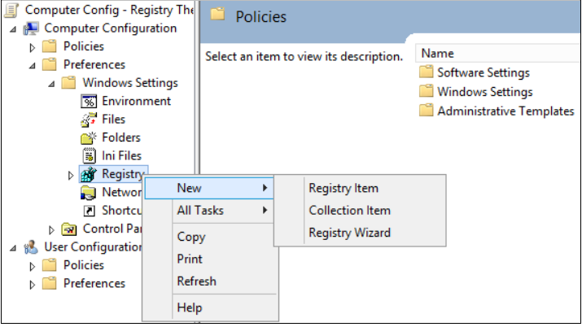
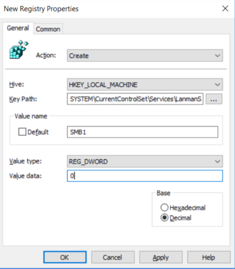
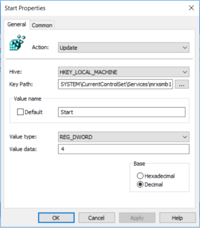
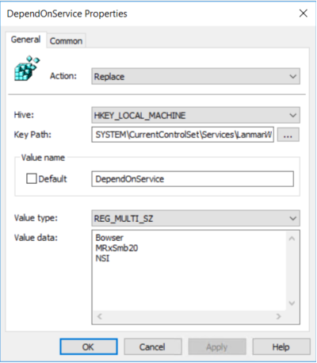
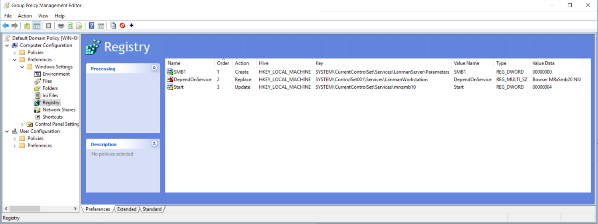
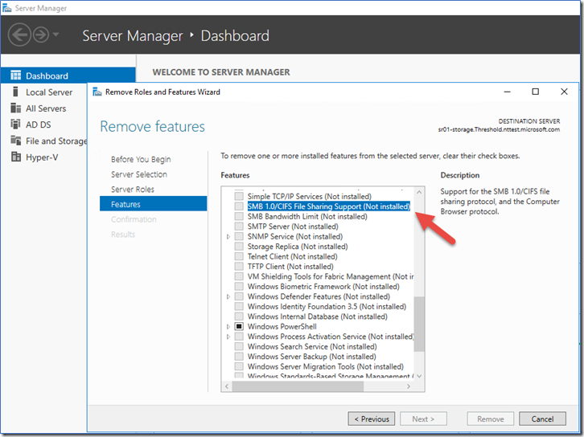
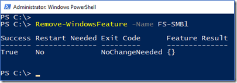
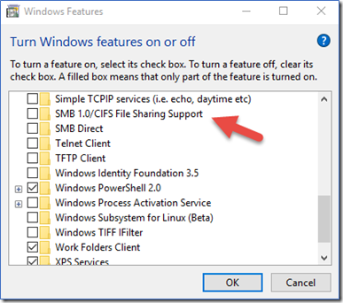
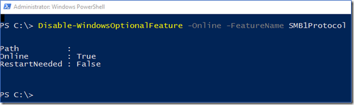

本文介绍如何在 SMB 客户端和服务器组件上启用/禁用服务器消息块 SMBv1、SMBv2 和 SMBv3。

注意：建议由专业技术工程师完成以下操作。

#禁用 SMBv2 和 SMBv3 的影响
我们建议不要禁用 SMBv2 或 SMBv3。禁用 SMBv2 或 SMBv3 只能作为临时故障排除措施。请勿使 SMBv2 或 SMBv3 保持禁用状态。

#禁用 SMBv2 的影响
在 Windows 7 和 Windows Server 2008 R2 中，禁用 SMBv2 会停用以下功能：

- 请求复合 - 允许发送多个 SMB 2 请求作为单个网络请求
- 大型读写 - 更好地利用更快速的网络
- 文件夹和文件属性缓存 - 客户端保留文件夹和文件的本地副本
- 持久句柄 - 如果临时断开连接，则允许连接以透明方式重新连接到服务器
- 改进的消息签名 - HMAC SHA-256 代替 MD5 作为哈希算法
- 改进的文件共享扩展性 - 每个服务器的用户数量、共享数量和打开文件数量大大增加
- 支持符号链接
- 客户端 oplock 租赁模式 - 限制在客户端和服务器之间传输的数据，从而提高高延迟网络性能并增强 SMB 服务器的扩展性
- 大型 MTU 支持 - 可充分利用 10 千兆字节 (GB) 以太网
- 改进的能效 - 向服务器打开文件的客户端可以睡眠

#禁用 SMBv3 的影响
在 Windows 8、Windows 8.1、Windows 10、Windows Server 2012 和 Windows Server 2016 中，禁用 SMBv3 会停用以下功能（以及以上列表中所述的 SMBv2 功能）：

- 透明故障转移 - 在维护或故障转移期间，客户端会重新连接，不会干扰群集节点
- 扩展 – 并发访问所有文件群集节点上的共享数据
- 多通道 - 如果客户端和服务器之间有多个路径可用时，则聚合网络带宽和容错
- SMB 直通 – 增加 RDMA 网络支持，实现极高的性能、低延迟和低 CPU 利用率
- 加密 – 提供端到端加密，并防止不可靠网络上的窃听
- 目录租赁 - 通过缓存改进分支机构中应用程序的响应时间
- 性能优化 - 对小型随机读/写 I/O 的优化

#在 SMB 服务器上启用/禁用 SMB 协议
##Windows 8 和 Windows Server 2012
Windows 8 和 Windows Server 2012 引入了新的 Set-SMBServerConfiguration Windows PowerShell cmdlet。 通过此 cmdlet，你可以在服务器组件上启用或禁用 SMBv1、SMBv2 和 SMBv3 协议。

注意：因为 SMBv2 和 SMBv3 共用一个堆叠，所以在 Windows 8 或 Windows Server 2012 中启用或禁用 SMBv2 时，也会启用或禁用 SMBv3。

###使用 PowerShell cmdlet
运行 Set-SMBServerConfiguration cmdlet 后，无须重启计算机。

- 若要获取 SMB 服务器协议配置的当前状态，请运行以下 cmdlet：
```
Get-SmbServerConfiguration | Select EnableSMB1Protocol, EnableSMB2Protocol
```

- 若要在 SMB 服务器上禁用 SMBv1，请运行以下 cmdlet：
```
Set-SmbServerConfiguration -EnableSMB1Protocol $false
```

- 若要在 SMB 服务器上禁用 SMBv2 和 SMBv3，请运行以下 cmdlet：
```
Set-SmbServerConfiguration -EnableSMB2Protocol $false
```

- 若要在 SMB 服务器上启用 SMBv1，请运行以下 cmdlet：
```
Set-SmbServerConfiguration -EnableSMB1Protocol $true
```

- 若要在 SMB 服务器上启用 SMBv2 和 SMBv3，请运行以下 cmdlet：
```
Set-SmbServerConfiguration -EnableSMB2Protocol $true
```

##Windows 7、Windows Server 2008 R2、Windows Vista 和 Windows Server 2008

若要在运行 Windows 7、Windows Server 2008 R2、Windows Vista 或 Windows Server 2008 的 SMB 服务器上启用或禁用 SMB 协议，请使用 Windows PowerShell 或注册表编辑器。

###使用 Windows PowerShell 2.0 或更高版本的 PowerShell

- 若要在 SMB 服务器上禁用 SMBv1，请运行以下 cmdlet：
```
Set-ItemProperty -Path "HKLM:\SYSTEM\CurrentControlSet\Services\LanmanServer\Parameters" SMB1 -Type DWORD -Value 0 -Force
```

- 若要在 SMB 服务器上禁用 SMBv2 和 SMBv3，请运行以下 cmdlet：
```
Set-ItemProperty -Path "HKLM:\SYSTEM\CurrentControlSet\Services\LanmanServer\Parameters" SMB2 -Type DWORD -Value 0 -Force
```

- 若要在 SMB 服务器上启用 SMBv1，请运行以下 cmdlet：
```
Set-ItemProperty -Path "HKLM:\SYSTEM\CurrentControlSet\Services\LanmanServer\Parameters" SMB1 -Type DWORD -Value 1 -Force
```

- 若要在 SMB 服务器上启用 SMBv2 和 SMBv3，请运行以下 cmdlet：
```
Set-ItemProperty -Path "HKLM:\SYSTEM\CurrentControlSet\Services\LanmanServer\Parameters" SMB2 -Type DWORD -Value 1 -Force
```

注意：进行这些更改后，必须重启计算机。

###使用注册表编辑器
注意：以下内容包含有关如何修改注册表的信息。修改注册表之前，一定要先对其进行备份。并且一定要知道在发生问题时如何还原注册表。有关如何备份、还原和修改注册表的更多信息，请查看 如何在 Windows 中备份和还原注册表。

- 若要在 SMB 服务器上启用或禁用 SMBv1，请配置以下注册表项：

 - 注册表子项：HKEY_LOCAL_MACHINE\SYSTEM\CurrentControlSet\Services\LanmanServer\Parameters 注册表项： SMB1
 - REG_DWORD： 0 = 已禁用
 - REG_DWORD： 1 = 已启用
 - 默认值： 1 = 已启用

- 若要在 SMB 服务器上启用或禁用 SMBv2，请配置以下注册表项：

 - 注册表子项：HKEY_LOCAL_MACHINE\SYSTEM\CurrentControlSet\Services\LanmanServer\Parameters 注册表项： SMB2
 - REG_DWORD： 0 = 已禁用
 - REG_DWORD： 1 = 已启用
 - 默认值： 1 = 已启用

#在 SMB 客户端上启用/禁用 SMB 协议

Windows Vista、Windows Server 2008、Windows 7、Windows Server 2008 R2、Windows 8 和 Windows Server 2012

注意：因为 SMBv2 和 SMBv3 共用一个堆叠，所以在 Windows 8 或 Windows Server 2012 中启用或禁用 SMBv2 时，也会启用或禁用 SMBv3。

- 若要在 SMB 客户端上禁用 SMBv1，请运行以下命令：
```
sc.exe config lanmanworkstation depend= bowser/mrxsmb20/nsi 
sc.exe config mrxsmb10 start= disabled
```

- 若要在 SMB 客户端上启用 SMBv1，请运行以下命令：
```
sc.exe config lanmanworkstation depend= bowser/mrxsmb10/mrxsmb20/nsi 
sc.exe config mrxsmb10 start= auto
```

- 若要在 SMB 客户端上禁用 SMBv2 和 SMBv3，请运行以下命令：
```
sc.exe config lanmanworkstation depend= bowser/mrxsmb10/nsi 
sc.exe config mrxsmb20 start= disabled
```

- 若要在 SMB 客户端上启用 SMBv2 和 SMBv3，请运行以下命令：
```
sc.exe config lanmanworkstation depend= bowser/mrxsmb10/mrxsmb20/nsi 
sc.exe config mrxsmb20 start= auto
```

注意:

- 必须在提升的命令提示符中运行这些命令。
- 进行这些更改后，必须重启计算机。

#使用组策略禁用 SMBv1 服务器
这将在注册表中配置以下新项:
```
HKEY_LOCAL_MACHINE\SYSTEM\CurrentControlSet\Services\LanmanServer\Parameters 注册表项： SMB1 REG_DWORD: 0 = Disabled
```
##使用组策略配置流程

1. 打开组策略管理控制台。右键单击应包含新首选项的组策略对象 (GPO)，然后单击 编辑。

2. 在 计算机配置 下的控制台树中，展开 首选项 文件夹，然后展开 Windows 设置 文件夹。

3. 右键单击 注册表 节点，指向 新建，然后选择 注册表项。


4. 在 新建注册表属性 对话框中，选择以下内容：

- 操作： 创建
- Hive： HKEY_LOCAL_MACHINE
- 注册表项路径： SYSTEM\CurrentControlSet\Services\LanmanServer\Parameters
- 值名称： SMB1
- 值类型： REG_DWORD
- 值数据： 0


5. 将此组策略应用到域中所有必需的工作站、服务器和域控制器，以禁用 SMBv1 服务器组件。也可以将 WMI 筛选器设置为不包含不受支持的操作系统或选中的排除项（如 Windows XP）。

注意：在旧版 Windows XP 或 Linux 早期版本以及第三方系统（不支持 SMBv2 或 SMBv3）需要访问 SYSVOL 或其他文件共享（已启用 SMB v1）的域控制器上进行这些更改时要谨慎小心。

#使用组策略禁用 SMBv1 客户端
若要禁用 SMBv1 客户端，需要将服务注册表项更新为禁止 MRxSMB10 启动，然后还需要将 MRxSMB10 的依赖项从 LanmanWorkstation 项中删除，以便它可以正常启动（无需首先启动 MRxSMB10）。

这将更新和替换注册表以下 2 个项中的默认值
```
HKEY_LOCAL_MACHINE\SYSTEM\CurrentControlSet\services\mrxsmb10 注册表项： Start REG_DWORD: 4 = Disabled
HKEY_LOCAL_MACHINE\SYSTEM\CurrentControlSet\Services\LanmanWorkstation 注册表项： DependOnService REG_MULTI_SZ: “Bowser”,”MRxSmb20″,”NSI”
```

注意：默认包含的 MRxSMB10 现已作为依赖项删除。

##使用组策略配置流程
1.打开组策略管理控制台。右键单击应包含新首选项的组策略对象 (GPO)，然后单击 编辑。

2.在 计算机配置 下的控制台树中，展开 首选项 文件夹，然后展开 Windows 设置 文件夹。

3.右键单击 注册表 节点，指向 新建，然后选择 注册表项。


4.在新建注册表属性 对话框中，选择以下内容：

- 操作： 更新
- Hive： HKEY_LOCAL_MACHINE
- 注册表项路径： SYSTEM\CurrentControlSet\services\mrxsmb10
- 值名称： Start
- 值类型： REG_DWORD
- 值数据： 4
- 


然后删除刚刚禁用的 MRxSMB10 的依赖项

5.在 新建注册表属性 对话框中，选择以下内容：

- 操作： 替换
- Hive： HKEY_LOCAL_MACHINE
- 注册表项路径： SYSTEM\CurrentControlSet\Services\LanmanWorkstation
- 值名称： DependOnService
- 值类型 REG_MULTI_SZ
- 值数据：
	- Bowser
	- MRxSmb20
	- NSI

注意： 这 3 个字符串不带项目符号（具体如下）



在 Windows 的多个版本中，默认值包括 MRxSMB10，通过将其替换为此多值字符串，实际上就删除了作为 LanmanServer 依赖项的 MRxSMB10，结果是从四个默认值减少为上述这三个值。

注意：使用组策略管理控制台时，无需使用引号或逗号。只需在各行键入每个项，如上面所示。

##需要重新启动
应用策略且正确设置注册表后，必须重新启动目标系统，然后才能禁用 SMB v1。

##摘要
如果所有设置均在同一组策略对象 (GPO) 中，组策略管理将显示以下设置。



##测试和验证
配置完成后即允许策略进行复制和更新。作为测试的必要步骤，请从 CMD.EXE 提示符处运行 gpupdate/force，然后查看目标计算机，以确保注册表设置得以正确应用。确保 SMBv2 和 SMBv3 在环境中的所有其他系统中正常运行。

注意：请务必重新启动目标系统。

#如何在 Windows 8.1、Windows 10、Windows 2012 R2 和 Windows Server 2016 中轻松删除 SMBv1

##Windows Server：使用 “服务器管理器”



##Windows Server：使用 PowerShell (Remove-WindowsFeature FS-SMB1)



##Windows 客户端：使用 “添加或删除程序”



##Windows 客户端：使用 PowerShell (Disable-WindowsOptionalFeature -Online -FeatureName smb1protocol)



#参考与适用性
本文来源自微软官方技术文档：[如何在 Windows 和 Windows Server 中启用和禁用 SMBv1、SMBv2 和 SMBv3](https://support.microsoft.com/zh-cn/help/2696547/how-to-enable-and-disable-smbv1-smbv2-and-smbv3-in-windows-and-windows?spm=5176.7757499.2.4.ZTMygG)。

如有变化，以微软官方为准。

这篇文章中的信息适用于:

- Windows 10 Pro released in July 2015,
- Windows 10 Enterprise released in July 2015
- Windows Vista Enterprise
- Windows Vista Business
- Windows Vista Home Basic
- Windows Vista Home Premium
- Windows Vista Ultimate
- Windows 7 Enterprise
- Windows 7 Home Basic
- Windows 7 Home Premium
- Windows 7 Professional
- Windows 7 Ultimate
- Windows Server 2008 Datacenter
- Windows Server 2008 Enterprise
- Windows Server 2008 Standard
- Windows Server 2008 R2 Datacenter
- Windows Server 2008 R2 Enterprise
- Windows Server 2008 R2 Standard
- Windows 8
- Windows 8 Enterprise
- Windows 8 Pro
- Windows Server 2012 Datacenter
- Windows Server 2012 Datacente
- Windows Server 2012 Essentials
- Windows Server 2012 Foundation
- Windows Server 2012 Foundation
- Windows Server 2012 Standard
- Windows Server 2012 Standard
- Windows Server 2016