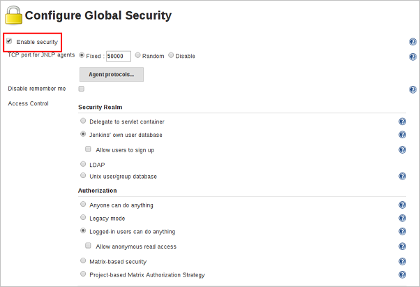
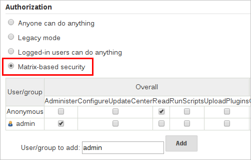
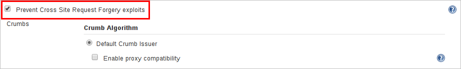

#Jenkins服务安全加固

Jenkins早期版本的默认配置下没有安全检查。任何人都可以以匿名用户身份进入Jenkins，执行build操作。然而，对大多数Jenkins应用，尤其是暴露在互联网的应用，安全控制是非常重要的。从Jenkins 2.0开始，其默认配置中启用了许多安全选项，以确保Jenkins环境安全，除非管理员明确禁用某些保护。

本文介绍了Jenkins管理员可操作的各种安全选项，用来加固您的Jenkins服务，以防被黑客攻击。

##Jenkins访问控制
Jenkins访问控制分为：**安全域（即认证）与授权策略。**

- 安全域决定Jenkins在认证的过程中从哪里寻找用户，默认选项有：Jenkins专有用户数据库，LDAP，和Servlet容器代理。

- 授权策略决定用户登录后可以做什么，默认选项有：任何用户可以做任何事（没有任何限制），安全矩阵，登录用户可以做任何事情，遗留模式，项目矩阵授权策略。

##Jenkins加固方案
###关注安全漏洞
定期关注[Jenkins官方安全公告](https://jenkins.io/security/advisories/?spm=a2c4g.11186623.2.3.8zWUc0#security-advisories)，使用或更新到官方最新版本的Jenkins，防止部署存在安全漏洞的版本。

###启用安全性设置
自2.0版本起，Jenkins默认勾选Enable security复选框。Jenkins管理员可以在Web UI的启用安全性部分启用，配置或禁用适用于整个Jenkins环境的关键安全功能。

默认情况下，匿名用户没有权限，而登录的用户具有完全的控制权。用户可以使用用户名和密码登录，以执行匿名用户不可用的操作。哪些操作要求用户登录取决于所选择的授权策略及其配置。对于任何非本地（测试）Jenkins环境，应始终启用此复选框。

###配置NLP TCP端口
Jenkins使用TCP端口与通过JNLP协议启动的代理（如基于Windows的代理）进行通信。截止Jenkins 2.0，默认情况下此端口被禁用。

对于希望使用基于JNLP代理的管理员，以下两种类型的端口可供选用：

- 随机：随机选择JNLP端口，避免Jenkins主机发生冲突 。该方式的缺点是在Jenkins主引导期间，难以管理允许JNLP流量的防火墙规则。
- 固定：由Jenkins管理员选择JNLP端口，端口在Jenkins主控器的重新启动之间是一致的。这使得管理防火墙规则更容易，允许基于JNLP的代理连接到主服务器。

###启用访问控制
访问控制是保护Jenkins环境免受未经授权使用的主要机制。在Jenkins中配置访问控制包括以下三个方面：

- **管理控制台**。根据一般的管理方式，管理人员不需要直接在互联网上进行管理，仅需要根据业务资深需求，对管理控制台访问源IP、端口进行限制，防止被恶意人员访问后台。

- **安全域**。通知Jenkins环境如何以及在哪里获取用户（或标识）的信息，也被称为“认证”。

- **授权配置**。通知Jenkins环境，哪些用户和/或组在多大程度上可以访问Jenkins的哪些方面。

使用安全域和授权配置，可以在Jenkins中轻松地配置非常刚性的身份验证和授权方案。此外，一些插件（如基于角色的授权策略）可以扩展Jenkins的访问控制功能，以支持更细微的身份验证和授权方案。

###选择合理的授权方式
安全领域或认证表明谁可以访问Jenkins环境，而授权解决的是他们可以在Jenkins环境中访问什么。

默认情况下，Jenkins支持以下的授权选项：

- **所有人都可以控制Jenkins**。每个人都可以完全控制Jenkins，包括尚未登录的匿名用户。请勿将本设置用于本地测试Jenkins管理以外的任何其他设置。

- **传统模式**。如果用户具有“admin”角色，他们将被授予对系统的完全控制权，否则该用户（包括匿名用户）将仅具有读访问权限。不要将本设置用于本地测试Jenkins管理以外的任何设置。

- **登录用户可以做任何事情**。在这种模式下，每个登录的用户都可以完全控制Jenkins。根据高级选项，还可以允许或拒绝匿名用户读取Jenkins的访问权限。此模式有助于强制用户在执行操作之前登录，以便有用户操作的审计跟踪。

- **基于矩阵的安全性**。该授权方案可以精确控制哪些用户和组能够在Jenkins环境中执行哪些操作。

基于项目的矩阵授权策略。此授权方案是基于Matrix的安全性的扩展，允许在项目配置屏幕中单独为每个项目定义附加的访问控制列表（ACL）。这允许授予特定用户或组访问指定的项目，而不是Jenkins环境中的所有项目。使用基于项目的矩阵授权定义的ACL是加法的，使得在“配置全局安全性”屏幕中定义的访问权限将与项目特定的ACL组合。

上图表中的每一行表示用户或组（也称为“角色”）。这包括名为“匿名”和“认证”的特殊条目。“匿名”条目表示授予访问Jenkins环境的所有未认证用户的权限。而“已认证”用于向访问环境的所有经过身份验证的用户授予权限。

矩阵中授予的权限是加法的。例如，如果用户“kohsuke”在“开发人员”和“管理员”组中，则授予“kohsuke”的权限将包含授予给“kohsuke”，“开发人员”，“管理员” ，“认证”和“匿名”的所有权限。

###选用与认证和用户管理相关的插件
Jenkins提供一系列与认证和用户管理相关的插件，用户可以根据业务需求安装使用（https://plugins.jenkins.io/） 。例如：

- Active Directory Plugin：允许使用Microsoft Active Directory（即Windows域账号）进行认证。

- Crowd Plugin：允许使用Atlassian Crowd进行认证。

- Script Security Realm Plugin：允许使用自定义的脚本进行认证。

- Role Strategy Plugin：提供了基于角色的授权策略，允许定义全局的和项目集的角色，并为用户分配相应角色。

###启用CSRF保护
跨站点请求伪造（或CSRF/XSRF）是一种漏洞，它允许未经授权的第三方通过模仿另一个经过身份验证的用户对Web应用程序执行请求。在Jenkins环境的上下文中，CSRF攻击可能允许恶意actor删除项目，更改构建或修改Jenkins的系统配置。

为了防范此类漏洞，自2.0以来所有Jenkins版本，在默认情况下都已启用CSRF保护。

启用该选项后，Jenkins将会在可能更改Jenkins环境中的数据的任何请求上检查CSRF令牌或“crumb”。这包括任何表单提交和对远程API的调用，包括使用“基本”身份验证的表单。

但是，CSRF保护可能会对Jenkins更高级的使用带来挑战，例如：

- 某些Jenkins功能（如远程API）在启用此选项时变得更难使用。
- 通过配置不正确的反向代理访问Jenkins，可能使CSRF HTTP头被从请求中删除，导致受保护的操作失败。
- 未经过CSRF保护测试的过时插件可能无法正常工作。

#参考资料
有关CSRF漏洞的更多信息，请参考[OWASP网站](https://www.owasp.org/index.php/Cross-Site_Request_Forgery?spm=a2c4g.11186623.2.5.8zWUc0)。

Jenkins提供比较丰富的安全功能，您可以参考更加详细的[官方文档](https://jenkins.io/doc/book/system-administration/security/?spm=a2c4g.11186623.2.6.8zWUc0)进行配置。