FileZilla 是一款免费的跨平台 FTP 应用程序，由 FileZilla Client 和 FileZilla Server 组成。本文档依据 FileZilla Server 0.9.59 版本，向您提供一系列简便有效的加固方案，帮助您安全地使用 FileZilla。

注意：本文提到的大部分配置都是通过 FileZilla 服务器的 Edit > Settings > FileZilla Server Options 菜单来实现的。

#设置管理密码

服务器的管理密码默认为空，建议您设置一个较复杂的密码。例如，应至少包含大小写字母、数字、特殊符号中的任意两种。

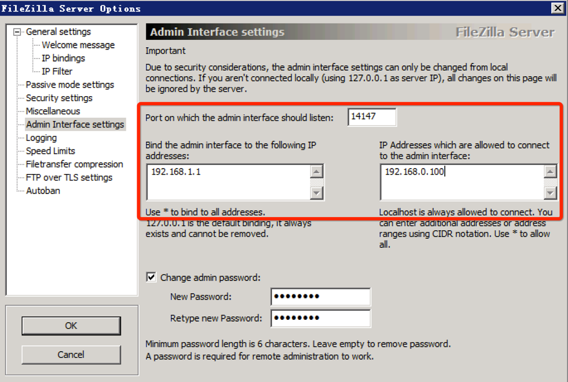

#修改 Banner 信息

在访问 FTP 服务器时，默认会在 Banner 中显示服务器的版本信息，通过屏蔽版本信息显示，可以加大恶意攻击的时间成本。操作步骤如下：

1. 前往 General settings > Welcome message。

2. 从右侧的 Custom welcome message 输入框中删除 %v 变量，或者直接将全部文本替换为自定义的文字。
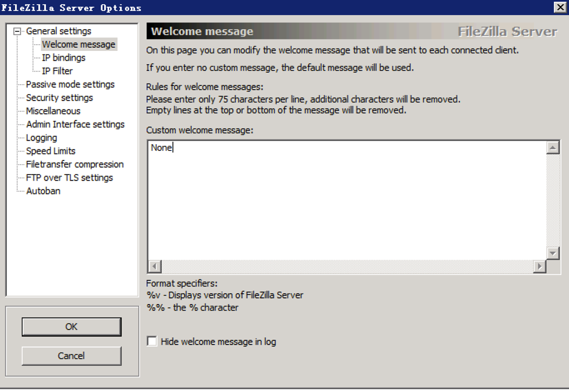

3. 建议勾选下面的 Hide welcome message in log，以减少日志中的垃圾信息。

#设置监听地址和端口

建议只在一个地址上启用 FTP 服务。例如，若您只需要在内网使用 FTP 服务时，就不必在服务器绑定的公网地址上开启 FTP 服务。操作步骤如下：

1. 前往 General settings > IP Bindings。

2. 在右侧窗口中将默认的 * 号修改为指定的地址。
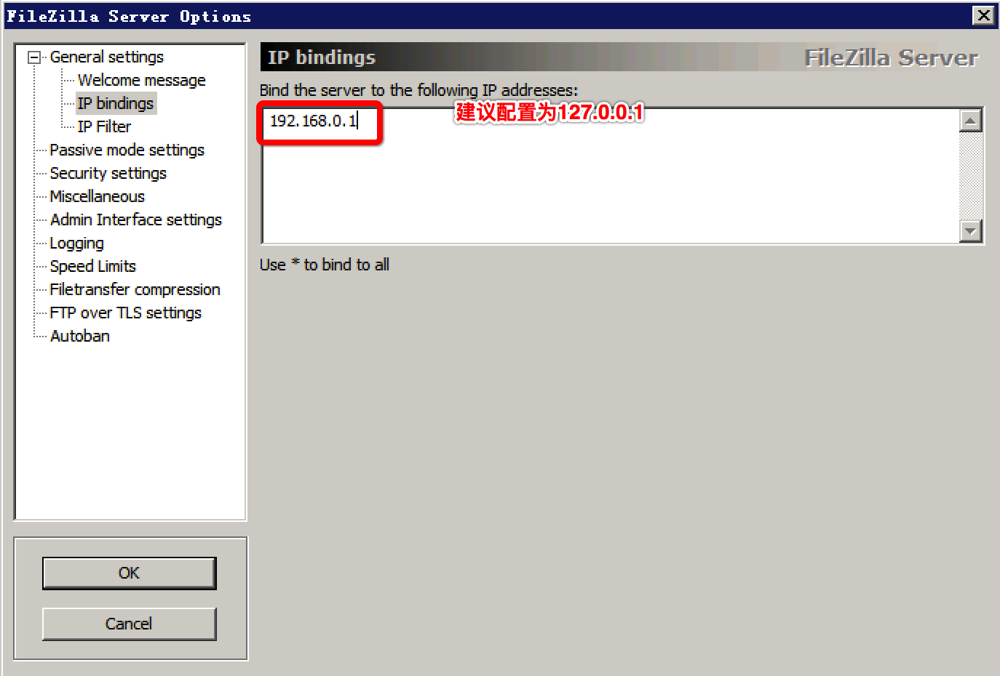

#使用访问控制

设置全局 IP 过滤器，限制允许访问的 IP 地址。操作步骤如下：

1. 前往 General settings > IP Filters。

2. 在右侧上部窗口中填入要阻止访问的 IP 范围，在右侧下部窗口中填写允许访问的 IP 范围。 
注意：通常采用阻止所有 IP（填写 *），然后仅允许部分 IP 的方式来进行有效的限制。例如，下图中仅允许 192.168.1.0/24 网段访问 FTP 服务。
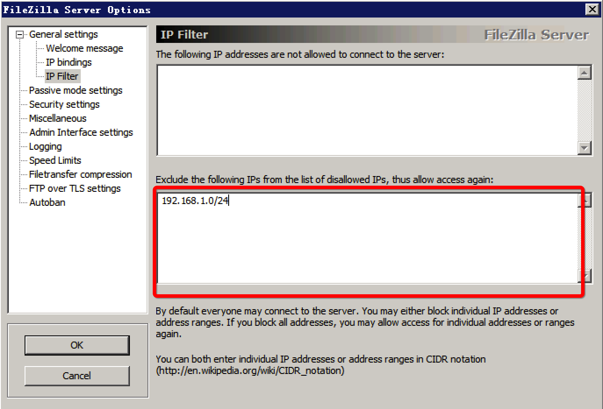

另外，FileZilla 服务器也支持用户级和用户组级的 IP 过滤器。前往 Edit > Users/Groups 打开对应设置页，在设置页中找到 IP Filters，然后选择需要设置的用户，设置允许和拒绝的 IP 即可。设置方法与全局 IP 过滤器相同。

#开启 FTP Bounce 攻击防护

FTP Bounce 攻击是一种利用 FXP 功能的攻击形式，默认情况下服务器未关闭相关功能，建议将相关功能设置为阻止。

如果服务器需要在与某个特定 IP 的服务器之间使用该功能，建议使用 IPs must match exactly 选项，然后通过 IP Filters（见 使用访问控制）来进行限制来访 IP。操作步骤如下：

1. 前往 General settings > Security settings。

2. 如下图所示，默认选项已经启用了需要精确匹配连接地址，建议不要修改。
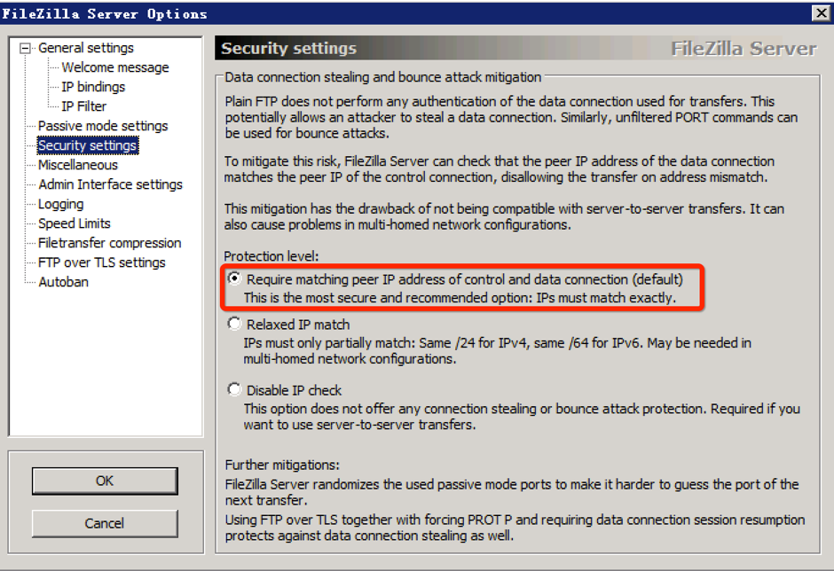

#配置用户认证策略

默认情况下，当出现多次用户认证失败后，服务器会断开与客户端的连接，但并没有严格的限制策略。通过下面的设置，可以对连续多次尝试登录失败的客户端 IP 进行阻止，干扰其连续尝试行为。

1. 前往 General settings > Autoban。

2. 下图中的设置会对一小时内连续 10 次登录失败的 IP 进行阻止，阻止时长为 1 个小时。
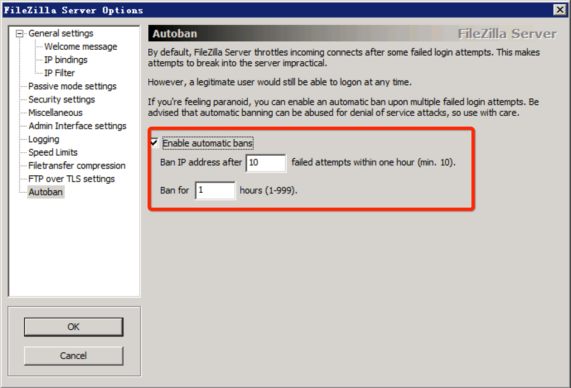

#提高用户密码复杂度

FileZilla 服务器未提供限制密码复杂度的选项，且服务器用户是由管理员通过管理接口来添加的，用户也无法通过 FTP 命令来修改密码。因此，建议管理员在添加用户时为用户配置复杂的密码。

#最小化访问授权

FileZilla 支持目录级别的访问权限设置，可对某个目录设置文件读 、写、删除、添加、目录创建、删除、列举等权限。建议根据实际应用需要，结合用户权限最小化原则来分配文件夹的权限。

注意：该操作需要提前添加账号和组后才能配置。

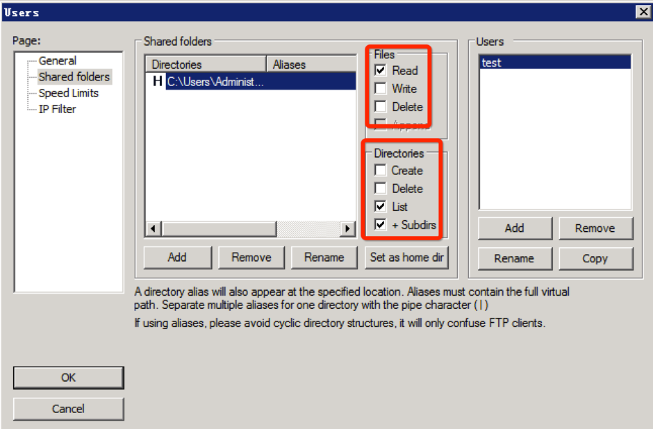

#启用 TLS 加密认证

FileZilla 服务器支持 TLS 加密功能，用户如果没有证书可以使用自带功能来创建。

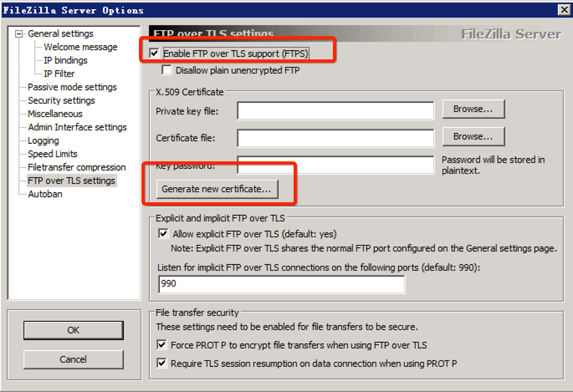

也支持针对单个用户强制启用 TLS 加密访问。

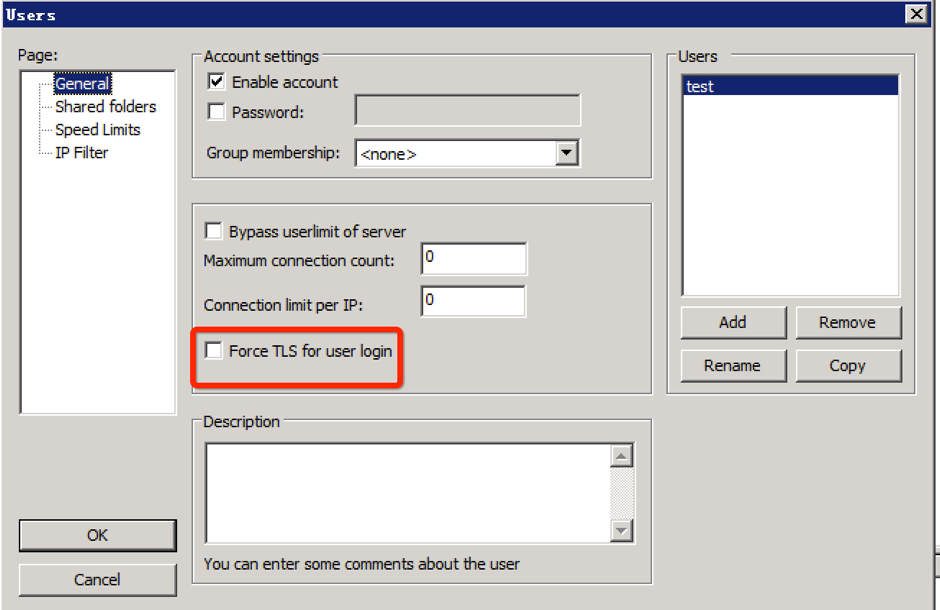

#启动日志记录

FileZilla 服务器默认未开启日志记录，为了方便对各种事件的追查，建议开启日志记录功能，并将日志设置为每天一个日志文件，避免单文件过大。

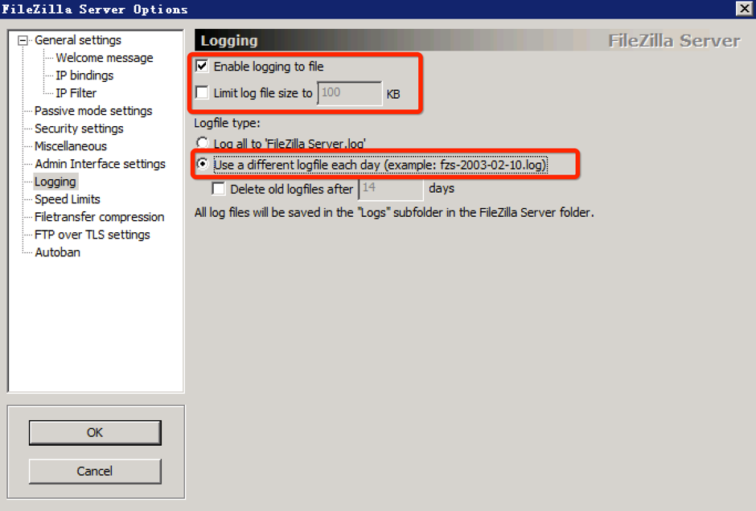

默认情况下，日志已经设置不记录用户密码；但在加固的时候应检查此选项，确保其已启用，避免密码泄露。

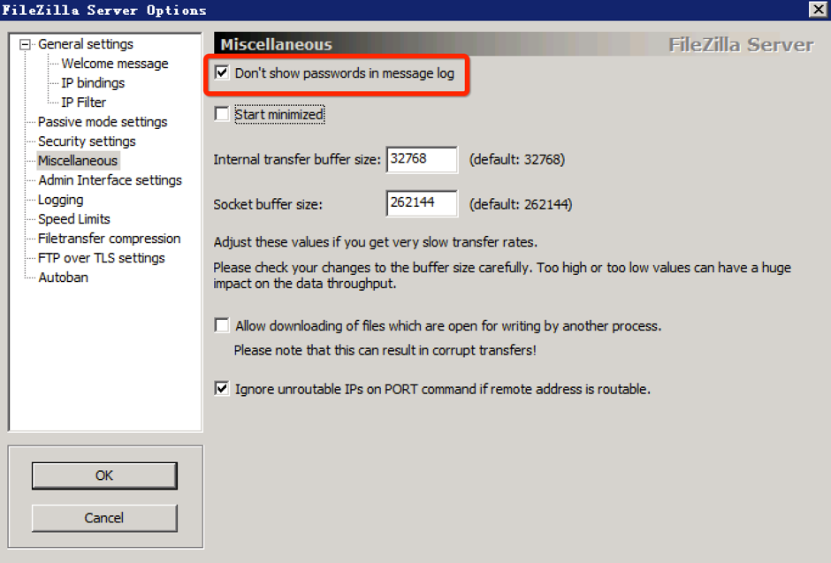