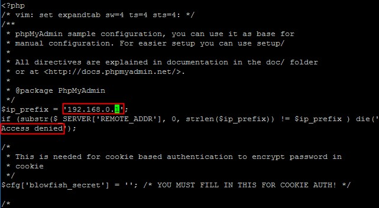

#漏洞描述

phpMyadmin 是一款流行的数据库管理系统，如果口令设置过于简单，攻击者可以登录到系统，对数据库进行任意增、删、改等高风险恶意操作，从而导致数据泄露或其他入侵事件发生，安全风险高。

#加固方案

根据通常的业务需求，数据库管理后台主要方便地为数据库管理员、开发人员服务，使用人员范围小，一旦对外网全部开放，将可能会造成严重的数据泄露事件发生。所以在部署安装完毕后，我们建议您对 phpMyadmin 管理控制台进行安全加固，具体如下:

#1.网络访问控制策略

限制访问人员 IP 配置 phpMyadmin。

- 您可以使用云服务器提供的 [安全组防火墙策略](https://help.aliyun.com/document_detail/25475.html?spm=5176.7737453.2.3.aRWi0J) 对访问源 IP 地址进行限制，避免不必要的人员访问数据库管理后台。

- phpMyadmin 也默认提供了访问控制功能，具体配置如下：<br>
进入 phpMyAdmin 目录，找到 config.inc.php，如果没有，可以将根目录下的config.sample.inc.php 复制为 config.inc.php。<br>
编辑 config.inc.php，添加下面两行代码，其中 192.168.0.1 是允许访问 phpMyAdmin 的 IP，Access denied 是未经授权访问时的提示信息：
<br>
```
?$ip_prefix = '192.168.0.1';
if (substr($_SERVER['REMOTE_ADDR'], 0, strlen($ip_prefix)) != $ip_prefix ) die('Access denied');
```
<br>


##2.账号与口令安全策略

- 设置强度复杂的口令，可以有效避免被攻击者轻易猜解成功，设置完毕后无需重启服务，及时生效；

- 根据使用人员角色对数据库账号进行精细化授权，防止运维风险；

具体可以参见 [MySQL服务加固文档-“授权”部分](https://help.aliyun.com/document_detail/49568.html?spm=5176.7737453.2.4.aRWi0J)。

##3.安全检测和监控

- 阿里云云盾态势感知支持该漏洞的检测和监控告警功能，建议您到控制台开通基础版态势感知，可以实时检测和告警，帮助您及时了解安全漏洞，并指导您快速修复该问题。

如果问题还未能解决，请联系售后技术支持。