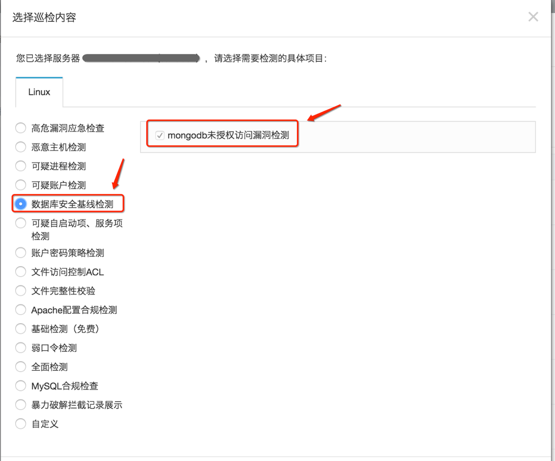
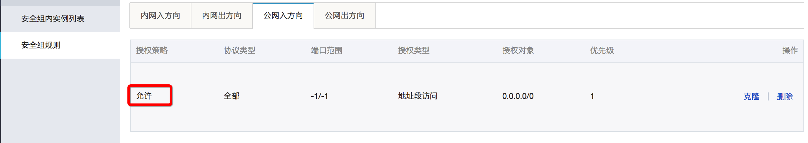
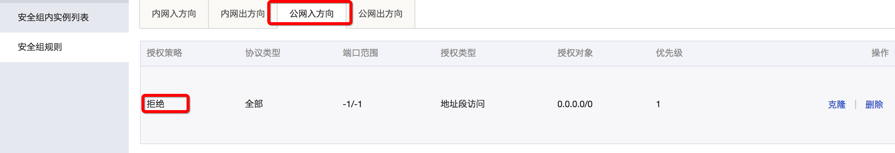
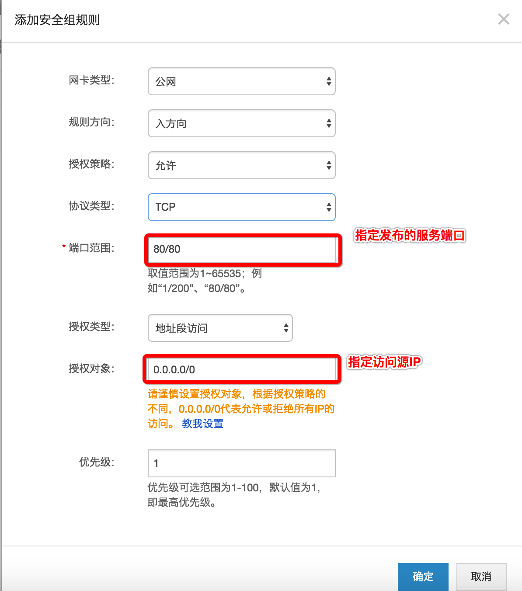
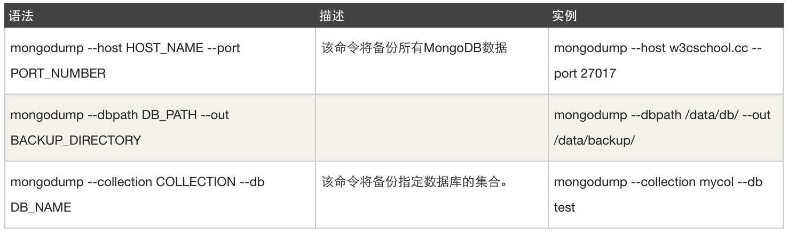

经检测发现部分阿里云用户存在MongoDB数据库未授权访问漏洞，漏洞危害严重，可以导致数据库数据泄露或被删除勒索，从而造成严重的生产事故。为保证您的业务和应用的安全，请根据以下修复漏洞指导方案加固MongoDB服务安全。

#漏洞详情

##漏洞危害

开启MongoDB服务后，如不添加任何参数，默认是没有权限验证的。登录的用户可以通过默认端口无需密码对数据库进行任意操作（包括增、删、改、查等高危动作），而且可以远程访问数据库。

##漏洞成因

安装完MongoDB服务后默认有一个admin数据库，此时admin数据库是空的，没有记录任何权限相关的信息。当admin.system.users一个用户都没有时，即使MongoDB启动时添加了—auth参数，如果没有在admin数据库中添加用户，此时不进行任何认证还是可以做任何操作(不管是否以—auth 参数启动)，直到在admin.system.users中添加一个用户。加固的核心方案是实现只有在admin.system.users中添加用户之后，MongoDB的认证、授权服务才能生效。

##漏洞自查

您可以登录到阿里云云盾控制台，使用云盾安骑士MongoDB检测是否存在此安全问题。



如果您是MongoDB管理员，也可以使用以下方式检查是否有进一步的入侵行为：

1. 查看MongoDB的日志是否完整，并确认执行删除数据库的源IP地址和时间、行为。

2. 检查MongoDB帐户，查看是否没有添加admin用户的密码（使用db.system.users.find()命令）。

3. 检查GridFS，查看是否存储任何文件（使用db.fs.files.find()命令）。

4. 检查日志文件，查看有哪些用户访问了MongoDB（使用show log global命令）。

#MongoDB未授权漏洞加固方案

重要提示： 如果您需要自己搭建MongoDB数据库，强烈推荐您使用[yum rpm方式安装MongoDB Server 服务](https://docs.mongodb.com/manual/tutorial/install-mongodb-on-red-hat/?spm=5176.7737451.2.3.iaGg8r)。

###1. 修改默认端口。
修改默认的MongoDB 端口（默认为：TCP 27017）为其他端口。

###2. 不要把MongoDB服务器直接部署在互联网或者DMZ上。<br>
使用安全组防火墙或本地操作系统防火墙对访问源IP进行控制，如果仅对内网服务器提供服务，建议禁止将MongoDB服务发布到互联网。
安全组相当于防火墙功能，默认公网入安全组策略为允许在互联网上访问所有端口。<br>
<br>
将默认安全组删除，添加拒绝所有规则，即可屏蔽服务。<br>
<br>
根据您的业务情况添加服务的允许规则。<br>


###3. 使用—bind_ip选项。<br>
该选项可以限制监听接口IP。当在启动MongoDB的时候，使用--bind_ip 192.168.0.1表示启动IP地址绑定，数据库实例将只监听192.168.0.1的请求。

###4. 启动基于角色的登录认证功能。<br>
在admin数据库中创建用户，如用户名supper，密码supWDxsf67%H（此处为举例说明，请勿使用此账号密码）。<br>
在未开启认证的环境下，登录到数据库。
```
[mongodb@rac3 bin]$ ./mongo 127.0.0.1:27028 (此处修改了默认端口)
MongoDB shell version: 2.0.1
connecting to: 127.0.0.1:27028/test
```
切换到admin数据库。
```
> use admin
switched to db admin
>
```
创建管理员账号。	
		\> db.addUser("supper", "supWDxsf67%H")或
		\>db.createUser({user:"supper",pwd:"supWDxsf67%H",roles:["root"]})
		
		{ "n" : 0, "connectionId" : 4, "err" : null, "ok" : 1 }
		{
		"user" : "supper",
		"readOnly" : false,
		"pwd" : "51a481f72b8b8218df9fee50b3737c44",
		"_id" : ObjectId("4f2bc0d357a309043c6947a4")
		}
管理员账号将在system.users中。
```
> db.getCollectionNames()
[ "system.indexes", "system.users", "system.version" ]
```
说明<br>
- MongoDB从V3版本开始取消使用addUser方法，采用db.createUser方法创建用户。
- 账号不要设置为常见账号，密码需要满足一定的复杂度，长度至少八位以上，并包括大小写字母、数字、特殊字符混合体，不要使用生日、姓名、身份证编号等常见密码。<br>
验证用户是否创建成功。
```
> db.auth("supper","supWDxsf67%H")
> exit
bye
```
结束进程，重启MongoDB服务。
```
./mongod --dbpath=/path/mongodb --bind_ip=192.168.0.1 --port=27028 --fork=true logpath=/path/mongod.log &
```
说明<br>
- admin.system.users中将会保存比在其它数据库中设置的用户权限更大的用户信息，拥有超级权限，也就是说在admin中创建的用户可以对mongodb中的其他数据库数据进行操作。
- MongoDB系统中，数据库是由超级用户来创建的，一个数据库可以包含多个用户，一个用户只能在一个数据库下，不同数据库中的用户可以同名。
- 特定数据库（比如DB1）的用户User1，不能够访问其他数据库DB2，但是可以访问本数据库下其他用户创建的数据。
- 不同数据库中同名的用户不能够登录其他数据库，比如DB1、DB2都有user1，以user1登录DB1后，不能够登录到DB2进行数据库操作。
- 在admin数据库创建的用户具有超级权限，可以对mongodb系统内的任何数据库的数据对象进行操作。
- 使用db.auth()可以对数据库中的用户进行验证，如果验证成功则返回1，否则返回0。 db.auth()只能针对登录用户所属的数据库的用户信息进行验证，不能验证其他数据库的用户信息。
更多选项说明请参见[MongoDB – Add Users and Authenticate](http://docs.mongoing.com/manual-zh/core/authentication.html?spm=5176.7737451.2.5.iaGg8r)。

###5. 禁用HTTP和REST端口。
MongoDB自身带有一个HTTP服务和并支持REST接口（在V2.6以后这些接口默认是关闭的）。MongoDB默认使用默认端口监听Web服务，一般不需要通过Web方式进行远程管理，建议禁用。
修改配置文件或在启动的时候选择–nohttpinterface参数即可。
```
nohttpinterface = false
```

###6. 开启日志审计功能。
审计功能可以用来记录用户对数据库的所有相关操作。这些记录可以让系统管理员在需要的时候分析数据库在什么时段发生了什么事情。
具体请参见[Mongodb审计功能](http://docs.mongoing.com/manual-zh/tutorial/configure-auditing.html?spm=5176.7737451.2.6.iaGg8r)。

###7. 使用SSL加密功能。
MongoDB集群之间以及从客户端连接到MongoDB实例的连接应该使用SSL。使用SSL对性能没有影响并且可以防范类似于man-in-the-middle的攻击。
注意MongoDB社区版默认并不支持SSL。您可以选用MongoDB企业版（支持SSL），或者从源码重新编译MongoDB并使用—ssl选项来获得SSL功能。
具体请参见[Configure mongod and mongos for TLS/SSL](http://docs.mongoing.com/manual-zh/tutorial/configure-ssl.html?spm=5176.7737451.2.7.iaGg8r)。
以上所有配置，推荐以配置文件形式保存配置。
```
[mongodb@rac3 bin]$ vim /path/mongod.conf
port=27028-------端口。默认为27017端口，MongoDB的默认服务TCP端口，监听客户端连接。要是端口设置小于1024，比如1021，则需要root权限启动，不能用mongodb帐号启动，（普通帐号即使是27017也起不来）否则报错：[mongo --port=1021 连接]
bind_ip=192.168.0.1------绑定地址。默认127.0.0.1，只能通过本地连接。进程绑定和监听来自这个地址上的应用连接。要是需要给其他服务器连接，则需要注释掉这个或则把IP改成本机地址，如192.168.200.201[其他服务器用 mongo --host=192.168.200.201 连接] ，可以用一个逗号分隔的列表绑定多个IP地址。
logpath=/path/mongod.log------开启日志审计功能，此项为日志文件路径，可以自定义指定。
pidfilepath=/path/mongod.pid------进程ID，没有指定则启动时候就没有PID文件。
auth=true------用户认证，默认false。不需要认证。当设置为true时候，进入数据库需要auth验证，当数据库里没有用户，则不需要验证也可以操作。直到创建了第一个用户，之后操作都需要验证。
logappend=true------写日志的模式：设置为true为追加。默认是覆盖。如果未指定此设置，启动时MongoDB的将覆盖现有的日志文件。
fork=true------是否后台运行，设置为true 启动 进程在后台运行的守护进程模式。默认false。
nohttpinterface = false------是否禁止http接口，即28017 端口开启的服务。默认false，支持。
```
然后，启动MongoDB服务时加载配置文件。
```
[mongodb@rac3 bin]$ ./mongod -f /path/mongod.conf
```
###8. 对业务关键敏感数据进行加密存储。
建议您梳理业务数据，对关键的敏感数据加密后入库，例如：账号、密码、邮箱地址、手机号码、身份ID等其他数据。加密算法推荐选择国际通用加密算法和多次加盐组合自定义算法，防止加密算法被破解。
即使黑客获取数据后，也查看不了数据，通过“看不懂”的数据加密方式将损失降到最低。

###9. 对数据进行本地异地备份。
完善的备份策略是保证数据安全的最后一根救命稻草。
推荐：可靠的本地备份+远程备份存储方案
- 本地备份
MongoDB备份方式
```
>mongodump -h dbhost -d dbname -o dbdirectory
-h：
MongDB所在服务器地址，例如：127.0.0.1，当然也可以指定端口号：127.0.0.1:27017
-d：
需要备份的数据库实例，例如：test
-o：
备份的数据存放位置，例如：c:\data\dump，该目录需要提前建立，在备份完成后，系统自动在dump目录下建立一个test目录，这个目录里面存放该数据库实例的备份数据。
```
MongoDB数据恢复
```
mongodb使用 mongorestore 命令来恢复备份的数据。
语法
mongorestore命令脚本语法如下：
>mongorestore -h dbhost -d dbname --directoryperdb dbdirectory
-h：
MongoDB所在服务器地址
-d：
需要恢复的数据库实例，例如：test，这个名称也可以和备份时候的不一样，比如test2。
--directoryperdb：
备份数据所在位置，例如：c:\data\dump\test。
--drop：
恢复的时候，先删除当前数据，然后恢复备份的数据。就是说，恢复后，备份后添加修改的数据都会被删除，慎用！
```
Mongodump命令可选参数列表如下所示。

备份策略
- 全量备份：可以最快的时间快速恢复所有数据，缺点是备份成本大，时间长。
- 全量备份+增量备份：可以较快的恢复所有数据，缺点是恢复时间长，如果增量数据有问题，无法恢复所有数据。
- 搭建从库：直接切换到从库，前提是从库的数据安全可靠。

###10. 使用阿里云MongoDB云服务。<br>
您可以使用更低的成本解决MongoDB的安全问题，阿里云MongoDB云数据库服务从设计之初就重点考虑了安全问题，比如完全不受针对删除数据库的勒索事件的影响。<br>
[阿里云MongoDB云数据库介绍](https://www.aliyun.com/product/mongodb?spm=5176.7737451.2.8.iaGg8r)<br>
更多关于MongoDB加固内容请参见[MongoDB security checklist](http://docs.mongoing.com/manual-zh/administration/security-checklist.html?spm=5176.7737451.2.9.iaGg8r)。