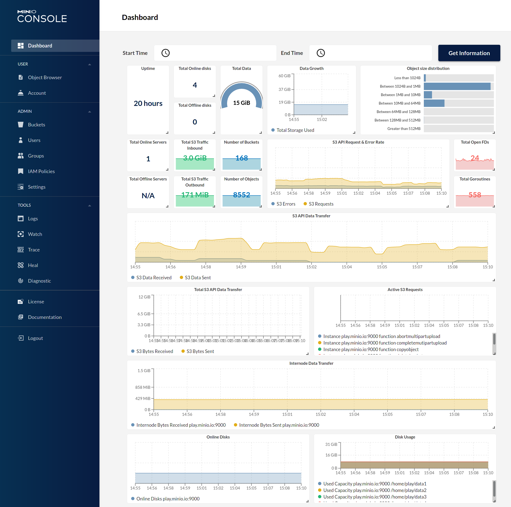

# MinIO Quickstart Guide

[](https://min.io)

MinIO 是在 GNU Affero 通用公共许可证 v3.0 下发布的高性能对象存储。 它是与 Amazon S3 云存储服务兼容的 API。 使用 MinIO 为机器学习、分析和应用程序数据工作负载构建高性能基础架构。

248 / 5000 翻译结果 此自述文件提供了在裸机硬件上运行 MinIO 的快速入门说明，包括基于容器的安装。 对于 Kubernetes 环境，请使用 [MinIO Kubernetes Operator](https://github.com/minio/operator/blob/master/README.md)。 

# 容器安装

使用以下命令将独立的 MinIO 服务器作为容器运行。

独立的 MinIO 服务器最适合早期开发和评估。 某些功能，例如版本控制、对象锁定和存储桶复制 需要使用擦除编码分布式部署 MinIO。 对于扩展的开发和生产，请在启用擦除编码的情况下部署 MinIO - 特别是， 每个 MinIO 服务器*最少* 4 个驱动器。 详见【MinIO擦除码快速入门指南】(http://docs.minio.org.cn/docs/minio-erasure-code-quickstart-guide.html) 获取更完整的文档。

## 稳定

运行以下命令以使用临时数据卷将 MinIO 的最新稳定映像作为容器运行：

```sh
podman run \
  -p 9000:9000 \
  -p 9001:9001 \
  minio/minio server /data --console-address ":9001"
```

MinIO 部署开始使用默认的 root 凭据 `minioadmin:minioadmin`。您可以使用 MinIO 控制台测试部署，这是一个嵌入式 内置于 MinIO 服务器的对象浏览器。将主机上运行的 Web 浏览器指向 http://127.0.0.1:9000 并使用 根凭据。您可以使用浏览器来创建桶、上传对象以及浏览 MinIO 服务器的内容。

您还可以使用任何与 S3 兼容的工具进行连接，例如 MinIO Client `mc` 命令行工具。见 [使用 MinIO 客户端 `mc` 进行测试](http://docs.minio.org.cn/docs/#test-using-minio-client-mc) 了解有关使用 `mc` 命令行工具的更多信息。对于应用程序开发人员， 请参阅 http://docs.minio.org.cn/docs/ 并单击导航中的 **MinIO SDKs** 以查看支持语言的 MinIO SDK。

> 注意：要在持久存储上部署 MinIO，您必须使用 `podman -v` 选项将本地持久目录从主机操作系统映射到容器。例如，`-v /mnt/data:/data` 将位于 `/mnt/data` 的主机操作系统驱动器映射到容器上的 `/data`。

# macOS

使用以下命令在 macOS 上运行独立的 MinIO 服务器。

独立的 MinIO 服务器最适合早期开发和评估。某些功能（例如版本控制、对象锁定和存储桶复制）需要使用擦除编码分布式部署 MinIO。对于扩展的开发和生产，部署启用擦除编码的 MinIO - 具体来说，每个 MinIO 服务器*最少* 4 个驱动器。更完整的文档请参见【MinIO 擦除码快速入门指南】(http://docs.minio.org.cn/docs/minio-erasure-code-quickstart-guide.html)。

## Homebrew（推荐）

运行以下命令以使用 [Homebrew](https://brew.sh/) 安装最新的稳定 MinIO 包。将`/data` 替换为您希望 MinIO 存储数据的驱动器或目录的路径。

```sh
brew install minio/stable/minio
minio server /data
```

> 注意：如果你之前使用 `brew install minio` 安装过 minio，那么建议你从 `minio/stable/minio` 官方 repo 重新安装 minio。

```sh
brew uninstall minio
brew install minio/stable/minio
```

MinIO 部署开始使用默认的 root 凭据 `minioadmin:minioadmin`。 您可以使用 MinIO 控制台测试部署，这是一个内置在 MinIO 服务器中的基于 Web 的嵌入式对象浏览器。 将主机上运行的 Web 浏览器指向 http://127.0.0.1:9000 并使用 root 凭据登录。 您可以使用浏览器来创建桶、上传对象以及浏览 MinIO 服务器的内容。

您还可以使用任何与 S3 兼容的工具进行连接，例如 MinIO Client `mc` 命令行工具。 有关使用 `mc` 命令行工具的更多信息，请参阅 [使用 MinIO 客户端 `mc` 进行测试](http://docs.minio.org.cn/docs/#test-using-minio-client-mc)。 对于应用程序开发人员，请参阅 http://docs.minio.org.cn/docs/ 并单击导航中的 **MinIO SDKs** 以查看支持语言的 MinIO SDK。

## 二进制下载

使用以下命令在 macOS 上下载并运行独立的 MinIO 服务器。 将`/data` 替换为您希望 MinIO 存储数据的驱动器或目录的路径。

```sh
wget http://dl.minio.org.cn/server/minio/release/darwin-amd64/minio
chmod +x minio
./minio server /data
```

MinIO 部署开始使用默认的 root 凭据 `minioadmin:minioadmin`。您可以使用 MinIO 控制台测试部署，这是一个内置在 MinIO 服务器中的基于 Web 的嵌入式对象浏览器。将主机上运行的 Web 浏览器指向 http://127.0.0.1:9000 并使用 root 凭据登录。您可以使用浏览器来创建桶、上传对象以及浏览 MinIO 服务器的内容。

您还可以使用任何与 S3 兼容的工具进行连接，例如 MinIO Client `mc` 命令行工具。有关使用 `mc` 命令行工具的更多信息，请参阅 [使用 MinIO 客户端 `mc` 进行测试](http://docs.minio.org.cn/docs/#test-using-minio-client-mc)。对于应用程序开发人员，请参阅 http://docs.minio.org.cn/docs/ 并单击导航中的 **MinIO SDKs** 以查看支持语言的 MinIO SDK。

# GNU/Linux

使用以下命令在运行 64 位 Intel/AMD 架构的 Linux 主机上运行独立的 MinIO 服务器。将`/data` 替换为您希望 MinIO 存储数据的驱动器或目录的路径。

```sh
wget http://dl.minio.org.cn/server/minio/release/linux-amd64/minio
chmod +x minio
./minio server /data
```

将`/data` 替换为您希望 MinIO 存储数据的驱动器或目录的路径。

下表列出了支持的架构。 将 `wget` URL 替换为您的 Linux 主机的架构。

| Architecture                | URL                                                          |
| --------------------------- | ------------------------------------------------------------ |
| 64-bit Intel/AMD            | http://dl.minio.org.cn/server/minio/release/linux-amd64/minio |
| 64-bit ARM                  | http://dl.minio.org.cn/server/minio/release/linux-arm64/minio |
| 64-bit PowerPC LE (ppc64le) | http://dl.minio.org.cn/server/minio/release/linux-ppc64le/minio |
| IBM Z-Series (S390X)        | http://dl.minio.org.cn/server/minio/release/linux-s390x/minio |

MinIO 部署开始使用默认的 root 凭据 `minioadmin:minioadmin`。您可以使用 MinIO 控制台测试部署，这是一个内置在 MinIO 服务器中的基于 Web 的嵌入式对象浏览器。将主机上运行的 Web 浏览器指向 http://127.0.0.1:9000 并使用 root 凭据登录。您可以使用浏览器来创建桶、上传对象以及浏览 MinIO 服务器的内容。

您还可以使用任何与 S3 兼容的工具进行连接，例如 MinIO Client `mc` 命令行工具。有关使用 `mc` 命令行工具的更多信息，请参阅 [使用 MinIO 客户端 `mc` 进行测试](http://docs.minio.org.cn/docs/#test-using-minio-client-mc)。对于应用程序开发人员，请参阅 http://docs.minio.org.cn/docs/ 并单击导航中的 **MinIO SDKs** 以查看支持语言的 MinIO SDK。

> 注意：独立的 MinIO 服务器最适合早期开发和评估。某些功能（例如版本控制、对象锁定和存储桶复制）需要使用擦除编码分布式部署 MinIO。对于扩展的开发和生产，部署启用擦除编码的 MinIO - 具体来说，每个 MinIO 服务器*最少* 4 个驱动器。更完整的文档请参见【MinIO 擦除码快速入门指南】(http://docs.minio.org.cn/docs/minio-erasure-code-quickstart-guide.html)。

# 微软视窗

要在 64 位 Windows 主机上运行 MinIO，请从以下 URL 下载 MinIO 可执行文件：

```sh
http://dl.minio.org.cn/server/minio/release/windows-amd64/minio.exe
```

使用以下命令在 Windows 主机上运行独立的 MinIO 服务器。 将“D:\”替换为您希望 MinIO 存储数据的驱动器或目录的路径。 您必须将终端或 powershell 目录更改为 `minio.exe` 可执行文件的位置，*或*将该目录的路径添加到系统 `$PATH` 中：

```sh
minio.exe server D:\
```

MinIO 部署开始使用默认的 root 凭据 `minioadmin:minioadmin`。您可以使用 MinIO 控制台测试部署，这是一个内置在 MinIO 服务器中的基于 Web 的嵌入式对象浏览器。将主机上运行的 Web 浏览器指向 http://127.0.0.1:9000 并使用 root 凭据登录。您可以使用浏览器来创建桶、上传对象以及浏览 MinIO 服务器的内容。

您还可以使用任何与 S3 兼容的工具进行连接，例如 MinIO Client `mc` 命令行工具。有关使用 `mc` 命令行工具的更多信息，请参阅 [使用 MinIO 客户端 `mc` 进行测试](http://docs.minio.org.cn/docs/#test-using-minio-client-mc)。对于应用程序开发人员，请参阅 http://docs.minio.org.cn/docs/ 并单击导航中的 **MinIO SDKs** 以查看支持语言的 MinIO SDK。

> 注意：独立的 MinIO 服务器最适合早期开发和评估。某些功能（例如版本控制、对象锁定和存储桶复制）需要使用擦除编码分布式部署 MinIO。对于扩展的开发和生产，部署启用擦除编码的 MinIO - 具体来说，每个 MinIO 服务器*最少* 4 个驱动器。更完整的文档请参见【MinIO 擦除码快速入门指南】(http://docs.minio.org.cn/docs/minio-erasure-code-quickstart-guide.html)。

# 从源码安装

使用以下命令从源代码编译和运行独立的 MinIO 服务器。源代码安装仅适用于开发人员和高级用户。如果您没有可用的 Golang 环境，请参考【如何安装 Golang】(https://golang.org/doc/install)。所需的最低版本是 [go1.16](https://golang.org/dl/#stable)

```sh
GO111MODULE=on go install github.com/minio/minio@latest
```

MinIO 部署开始使用默认的 root 凭据 `minioadmin:minioadmin`。您可以使用 MinIO 控制台测试部署，这是一个内置在 MinIO 服务器中的基于 Web 的嵌入式对象浏览器。将主机上运行的 Web 浏览器指向 http://127.0.0.1:9000 并使用 root 凭据登录。您可以使用浏览器来创建桶、上传对象以及浏览 MinIO 服务器的内容。

您还可以使用任何与 S3 兼容的工具进行连接，例如 MinIO Client `mc` 命令行工具。有关使用 `mc` 命令行工具的更多信息，请参阅 [使用 MinIO 客户端 `mc` 进行测试](http://docs.minio.org.cn/docs/#test-using-minio-client-mc)。对于应用程序开发人员，请参阅 http://docs.minio.org.cn/docs/ 并单击导航中的 **MinIO SDKs** 以查看支持语言的 MinIO SDK。

> 注意：独立的 MinIO 服务器最适合早期开发和评估。某些功能（例如版本控制、对象锁定和存储桶复制）需要使用擦除编码分布式部署 MinIO。对于扩展的开发和生产，部署启用擦除编码的 MinIO - 具体来说，每个 MinIO 服务器*最少* 4 个驱动器。更完整的文档请参见【MinIO 擦除码快速入门指南】(http://docs.minio.org.cn/docs/minio-erasure-code-quickstart-guide.html)。

MinIO 强烈建议*反对* 在生产环境中使用从源代码编译的 MinIO 服务器。

# 部署建议

## 允许防火墙的端口访问

默认情况下，MinIO 使用端口 9000 来侦听传入连接。如果您的平台默认阻止该端口，您可能需要启用对该端口的访问。

### ufw

对于启用了 ufw 的主机（基于 Debian 的发行版），您可以使用 `ufw` 命令来允许流量到特定端口。使用以下命令允许访问端口 9000

```sh
ufw allow 9000
```

下面的命令启用所有传入端口的流量，范围从 9000 到 9010。

```sh
ufw allow 9000:9010/tcp
```

### 防火墙-cmd

对于启用了 firewall-cmd (CentOS) 的主机，您可以使用 `firewall-cmd` 命令来允许特定端口的流量。 使用以下命令允许访问端口 9000

```sh
firewall-cmd --get-active-zones
```

此命令获取活动区域。 现在，将端口规则应用于上面返回的相关区域。 例如，如果区域是`public`，请使用

```sh
firewall-cmd --zone=public --add-port=9000/tcp --permanent
```

请注意，“permanent”确保规则在防火墙启动、重启或重新加载时是持久的。 最后重新加载防火墙以使更改生效。

```sh
firewall-cmd --reload
```

### iptables

对于启用了 iptables 的主机（RHEL、CentOS 等），您可以使用 `iptables` 命令来启用进入特定端口的所有流量。 使用以下命令允许 访问 9000 端口

```sh
iptables -A INPUT -p tcp --dport 9000 -j ACCEPT
service iptables restart
```

下面的命令启用所有传入端口的流量，范围从 9000 到 9010。

```sh
iptables -A INPUT -p tcp --dport 9000:9010 -j ACCEPT
service iptables restart
```

## 预先存在的数据

当部署在单个驱动器上时，MinIO 服务器允许客户端访问数据目录中的任何预先存在的数据。例如，如果 MinIO 是用命令 `minio server /mnt/data` 启动的，`/mnt/data` 目录中的任何预先存在的数据都可以被客户端访问。

上述语句也适用于所有网关后端。

# 测试 MinIO 连接

## 使用 MinIO 控制台进行测试

MinIO Server 带有一个基于 Web 的嵌入式对象浏览器。将您的 Web 浏览器指向 http://127.0.0.1:9000 以确保您的服务器已成功启动。

> 注意：默认情况下，MinIO 在随机端口上运行控制台，如果您希望选择特定端口，请使用 `--console-address` 来选择特定接口和端口。

### 需要考虑的事情

MinIO 将浏览器访问请求重定向到配置的服务器端口（即`127.0.0.1:9000`）到配置的控制台端口。 MinIO 在构建重定向 URL 时使用请求中指定的主机名或 IP 地址。 URL 和端口  *必须* 可由客户端访问才能使重定向工作

对于 MinIO 主机 IP 地址或端口不公开的负载均衡器、代理或入口规则后面的部署，请使用 `MINIO_BROWSER_REDIRECT_URL` 环境变量为重定向指定外部主机名。 LB/Proxy 必须有专门将流量定向到控制台端口的规则。

例如，考虑在代理 `https://minio.example.net`、`https://console.minio.example.net` 后面的 MinIO 部署，其规则将端口 :9000 和 :9001 上的流量转发到 MinIO 和分别在内部网络上的 MinIO Console。将 `MINIO_BROWSER_REDIRECT_URL` 设置为 `https://console.minio.example.net` 以确保浏览器接收到有效的可访问 URL。

| Dashboard                                | Creating a bucket                        |
| ---------------------------------------- | ---------------------------------------- |
|  |  |

## 使用 MinIO Client `mc` 进行测试

`mc` 为 ls、cat、cp、mirror、diff 等 UNIX 命令提供了一种现代替代方案。它支持文件系统和 Amazon S3 兼容的云存储服务。 按照 MinIO 客户端 [快速入门指南](http://docs.minio.org.cn/docs/minio-client-quickstart-guide) 获取更多说明。

# 升级 MinIO

MinIO 服务器支持滚动升级，即您可以在分布式集群中一次更新一个 MinIO 实例。 这允许在不停机的情况下进行升级。 升级可以通过用最新版本替换二进制文件并以滚动方式重新启动所有服务器来手动完成。 但是，我们建议所有用户从客户端使用 [`mc admin update`](http://docs.minio.org.cn/docs/minio-admin-complete-guide.html#update)。 这将同时更新集群中的所有节点并重新启动它们，如来自 MinIO 客户端 (mc) 的以下命令所示：

```
mc admin update <minio alias, e.g., myminio>
```

> 注意：某些版本可能不允许滚动升级，这总是在发行说明中提到，通常建议在升级前阅读发行说明。在这种情况下，`mc admin update` 是一次升级所有服务器的推荐升级机制。

## MinIO 升级期间要记住的重要事项

- `mc admin update` 仅在运行 MinIO 的用户对二进制文件所在的父目录具有写访问权限时才有效，例如，如果当前二进制文件位于 `/usr/local/bin/minio`，则需要写入访问`/usr/local/bin`。
- `mc admin update` 同时更新和重启所有服务器，应用程序会在升级后重试并继续各自的操作。
- `mc admin update` 在 kubernetes/container 环境中被禁用，容器环境提供自己的机制来推出更新。
- 在联合设置的情况下，`mc admin update` 应该单独针对每个集群运行。在所有集群成功更新之前，避免将 `mc` 更新为任何新版本。
- 如果使用 `kes` 作为 MinIO 的 KMS，只需替换二进制文件并重新启动 `kes` 有关 `kes` 的更多信息可以在 [here](https://github.com/minio/kes/wiki) 中找到
- 如果将 Vault 作为 KMS 与 MinIO 一起使用，请确保您已遵循此处概述的 Vault 升级过程：https://www.vaultproject.io/docs/upgrading/index.html
- 如果将 etcd 与 MinIO 用于联合，请确保您已遵循此处概述的 etcd 升级过程：https://github.com/etcd-io/etcd/blob/master/Documentation/upgrades/upgrading-etcd.md

# 进一步探索

- [MinIO 擦除码快速入门指南](http://docs.minio.org.cn/docs/minio-erasure-code-quickstart-guide)
- [在 MinIO 服务器上使用 `mc`](http://docs.minio.org.cn/docs/minio-client-quickstart-guide)
- [在 MinIO 服务器上使用 `aws-cli`](http://docs.minio.org.cn/docs/aws-cli-with-minio)
- [在 MinIO 服务器上使用 `s3cmd`](http://docs.minio.org.cn/docs/s3cmd-with-minio)
- [在 MinIO 服务器上使用 `minio-go` SDK](http://docs.minio.org.cn/docs/golang-client-quickstart-guide)
- [MinIO 文档网站](http://docs.minio.org.cn)

# 为 MinIO 项目做贡献

请遵循 MinIO [贡献者指南](https://github.com/minio/minio/blob/master/CONTRIBUTING.md)

# 许可证

MinIO 的使用受 GNU AGPLv3 许可证管理，该许可证可在 [许可证](https://github.com/minio/minio/blob/master/LICENSE) 文件中找到。