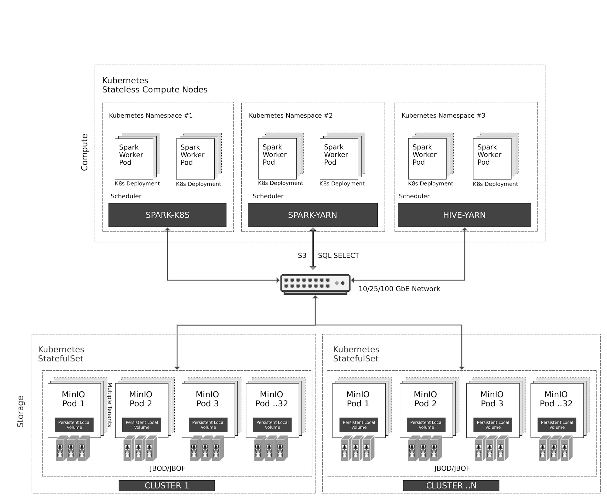
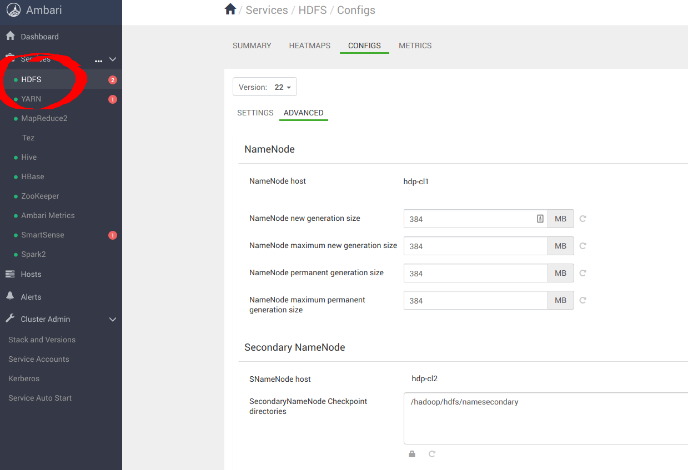
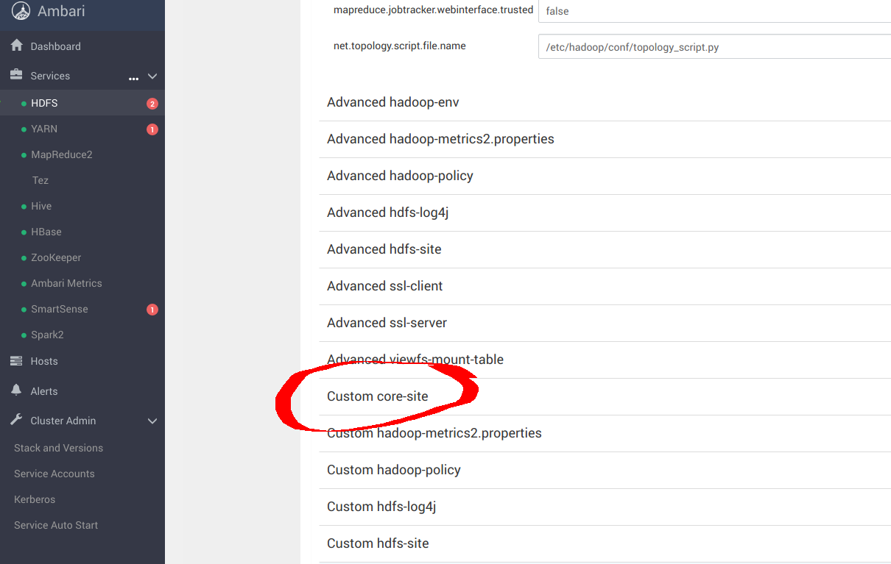
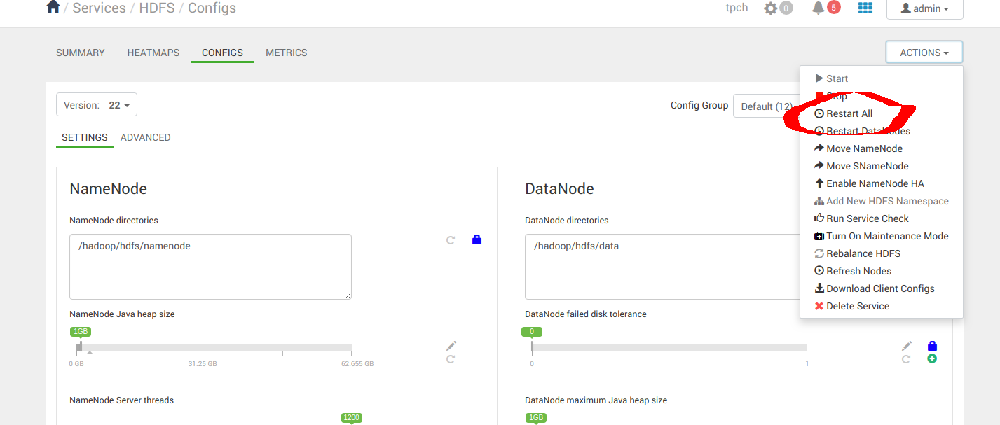
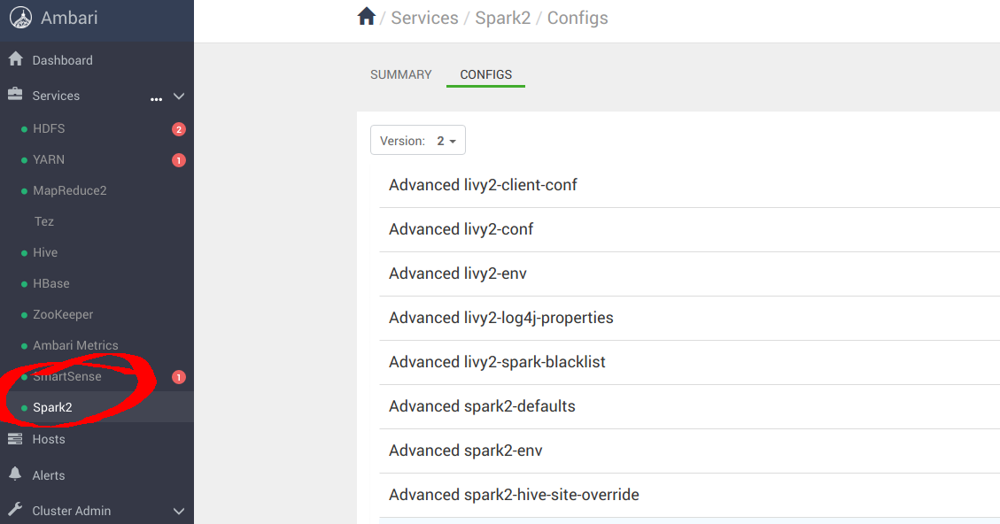
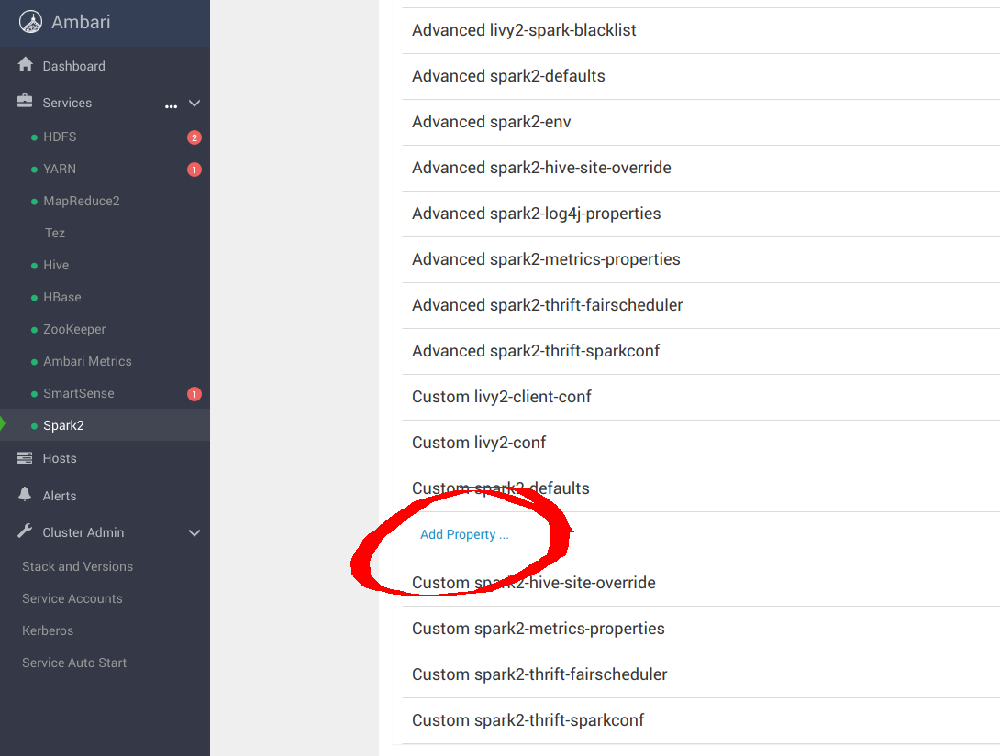
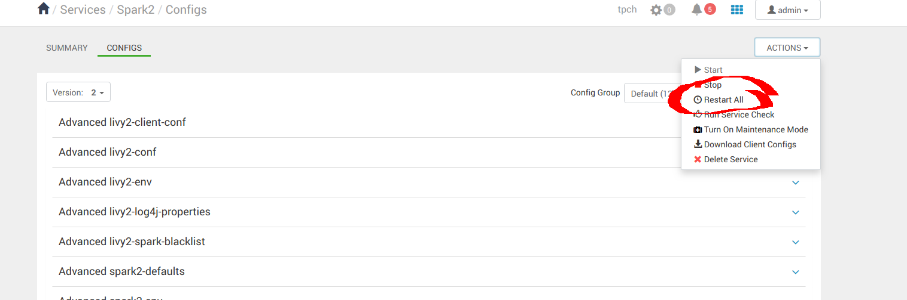
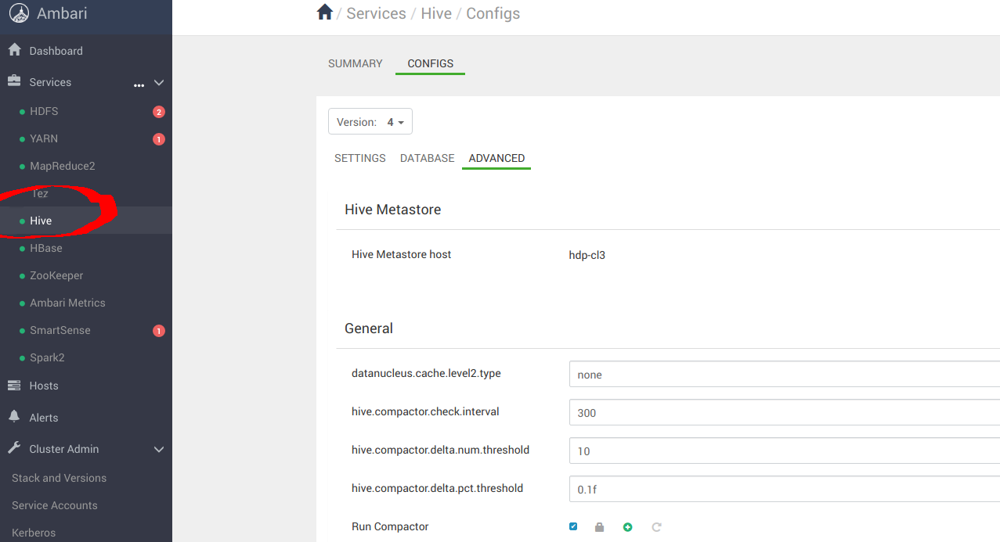
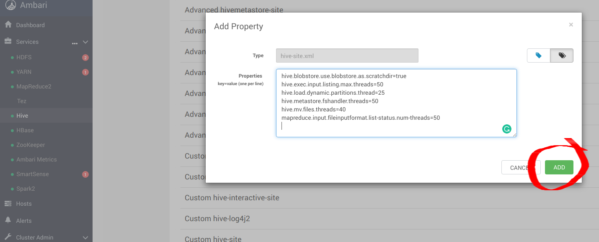
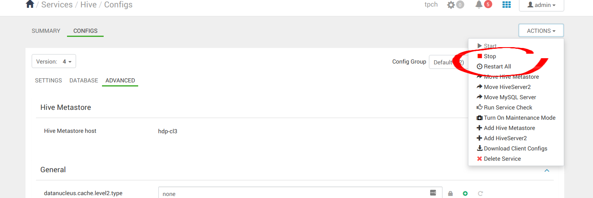

# **使用MinIO分解的HDP Spark和Hive**

## **1.云原生架构**



Kubernetes在计算节点上弹性地管理无状态的Spark和Hive容器。Spark具有与Kubernetes的本机调度程序集成。由于传统原因，Hive在Kubernetes上使用YARN调度程序。

通过S3 / SQL SELECT  API对MinIO对象存储的所有访问。除了计算节点外，Kubernetes还将MinIO容器作为有状态容器进行管理，其状态存储（JBOD /  JBOF）映射为持久性本地卷。这种架构支持多租户MinIO，从而可以隔离客户之间的数据。

MinIO还支持类似于AWS区域和层的多集群，多站点联合。使用MinIO信息生命周期管理（ILM），可以将数据配置为在基于NVMe的热存储和基于HDD的热存储之间分层。所有数据均使用每个对象的密钥加密。MinIO使用OpenID Connect或Kerberos / LDAP / AD对租户之间的访问控制和身份管理进行管理。

## **2. 先决条件**

- 使用本

  guide.

  安装Hortonworks Distribution 

  - [设置 Ambari](https://docs.hortonworks.com/HDPDocuments/Ambari-2.7.1.0/bk_ambari-installation/content/set_up_the_ambari_server.html) 它会自动设置YARN
  - [安装 Spark](https://docs.hortonworks.com/HDPDocuments/HDP3/HDP-3.0.1/installing-spark/content/installing_spark.html)

- 使用以下指南之一安装MinIO Distributed Server。

  - [基于Kubernetes的部署](http://docs.minio.org.cn/docs/master/deploy-minio-on-kubernetes.html#minio-distributed-server-deployment)
  - [基于MinIO Helm Chart的部署](https://github.com/helm/charts/tree/master/stable/minio)

## **3. 配置Hadoop，Spark，Hive以使用MinIO**

A成功安装后，导航到Ambari UI http://:8080/并使用默认凭据登录： [***用户名: admin, 密码: admin\***]


### **3.1 配置Hadoop**

导航到 **服务** -> **HDFS** -> **CONFIGS** -> **高级** 如下所示



导航到 **自定义核心网站** 为`_s3a_`连接器配置MinIO参数



```
sudo pip install yq
alias kv-pairify='xq ".configuration[]" | jq ".[]" | jq -r ".name + \"=\" + .value"'
```

让我们以12个计算节点的集合（聚合内存为1.2TiB）为例，我们需要进行以下设置以获得最佳结果。以下最佳项添加核心的site.xml配置S3A与MinIO。这里最重要的选择是

```
cat ${HADOOP_CONF_DIR}/core-site.xml | kv-pairify | grep "mapred"

mapred.maxthreads.generate.mapoutput=2 # Num threads to write map outputs
mapred.maxthreads.partition.closer=0 # Asynchronous map flushers
mapreduce.fileoutputcommitter.algorithm.version=2 # Use the latest committer version
mapreduce.job.reduce.slowstart.completedmaps=0.99 # 99% map, then reduce
mapreduce.reduce.shuffle.input.buffer.percent=0.9 # Min % buffer in RAM
mapreduce.reduce.shuffle.merge.percent=0.9 # Minimum % merges in RAM
mapreduce.reduce.speculative=false # Disable speculation for reducing
mapreduce.task.io.sort.factor=999 # Threshold before writing to disk
mapreduce.task.sort.spill.percent=0.9 # Minimum % before spilling to disk
```

S3A是使用S3和其他与S3兼容的对象存储库（如MinIO）的连接器。MapReduce工作负载通常以与HDFS相同的方式与对象存储交互。这些工作负载依靠HDFS原子重命名功能来完成将数据写入数据存储中。对象存储操作本质上是原子的，不需要/实现重命名API。默认的S3A提交者通过复制和删除API模拟重命名。由于写入放大，这种交互模式会导致性能显着下降。奈飞例如，开发了两个新的登台提交程序-目录登台提交程序和分区登台提交程序-以充分利用本机对象存储操作。这些提交者不需要重命名操作。评估了两个登台提交者，以及另一个称为基准的Magic提交者。

发现目录登台提交程序是三个中最快的，S3A连接器应配置以下参数以获得最佳结果：

```
cat ${HADOOP_CONF_DIR}/core-site.xml | kv-pairify | grep "s3a"

fs.s3a.access.key=minio
fs.s3a.secret.key=minio123
fs.s3a.path.style.access=true
fs.s3a.block.size=512M
fs.s3a.buffer.dir=${hadoop.tmp.dir}/s3a
fs.s3a.committer.magic.enabled=false
fs.s3a.committer.name=directory
fs.s3a.committer.staging.abort.pending.uploads=true
fs.s3a.committer.staging.conflict-mode=append
fs.s3a.committer.staging.tmp.path=/tmp/staging
fs.s3a.committer.staging.unique-filenames=true
fs.s3a.connection.establish.timeout=5000
fs.s3a.connection.ssl.enabled=false
fs.s3a.connection.timeout=200000
fs.s3a.endpoint=http://minio:9000
fs.s3a.impl=org.apache.hadoop.fs.s3a.S3AFileSystem

fs.s3a.committer.threads=2048 # Number of threads writing to MinIO
fs.s3a.connection.maximum=8192 # Maximum number of concurrent conns
fs.s3a.fast.upload.active.blocks=2048 # Number of parallel uploads
fs.s3a.fast.upload.buffer=disk # Use disk as the buffer for uploads
fs.s3a.fast.upload=true # Turn on fast upload mode
fs.s3a.max.total.tasks=2048 # Maximum number of parallel tasks
fs.s3a.multipart.size=512M # Size of each multipart chunk
fs.s3a.multipart.threshold=512M # Size before using multipart uploads
fs.s3a.socket.recv.buffer=65536 # Read socket buffer hint
fs.s3a.socket.send.buffer=65536 # Write socket buffer hint
fs.s3a.threads.max=2048 # Maximum number of threads for S3A
```

其他优化选项的其余部分将在下面的链接中讨论

- https://hadoop.apache.org/docs/current/hadoop-aws/tools/hadoop-aws/index.html
- https://hadoop.apache.org/docs/r3.1.1/hadoop-aws/tools/hadoop-aws/committers.html

应用配置更改后，继续重新启动 **Hadoop** 服务。



### **3.2 配置Spark2**

导航到**服务** -> **Spark2** -> **CONFIGS**， 如下所示



导航到“**Custom spark-defaults**”以配置_s3a_连接器的MinIO参数



为spark-defaults.conf添加以下最佳条目，以使用 **MinIO** 配置Spark 。

```
spark.hadoop.fs.s3a.access.key minio
spark.hadoop.fs.s3a.secret.key minio123
spark.hadoop.fs.s3a.path.style.access true
spark.hadoop.fs.s3a.block.size 512M
spark.hadoop.fs.s3a.buffer.dir ${hadoop.tmp.dir}/s3a
spark.hadoop.fs.s3a.committer.magic.enabled false
spark.hadoop.fs.s3a.committer.name directory
spark.hadoop.fs.s3a.committer.staging.abort.pending.uploads true
spark.hadoop.fs.s3a.committer.staging.conflict-mode append
spark.hadoop.fs.s3a.committer.staging.tmp.path /tmp/staging
spark.hadoop.fs.s3a.committer.staging.unique-filenames true
spark.hadoop.fs.s3a.committer.threads 2048 # number of threads writing to MinIO
spark.hadoop.fs.s3a.connection.establish.timeout 5000
spark.hadoop.fs.s3a.connection.maximum 8192 # maximum number of concurrent conns
spark.hadoop.fs.s3a.connection.ssl.enabled false
spark.hadoop.fs.s3a.connection.timeout 200000
spark.hadoop.fs.s3a.endpoint http://minio:9000
spark.hadoop.fs.s3a.fast.upload.active.blocks 2048 # number of parallel uploads
spark.hadoop.fs.s3a.fast.upload.buffer disk # use disk as the buffer for uploads
spark.hadoop.fs.s3a.fast.upload true # turn on fast upload mode
spark.hadoop.fs.s3a.impl org.apache.hadoop.spark.hadoop.fs.s3a.S3AFileSystem
spark.hadoop.fs.s3a.max.total.tasks 2048 # maximum number of parallel tasks
spark.hadoop.fs.s3a.multipart.size 512M # size of each multipart chunk
spark.hadoop.fs.s3a.multipart.threshold 512M # size before using multipart uploads
spark.hadoop.fs.s3a.socket.recv.buffer 65536 # read socket buffer hint
spark.hadoop.fs.s3a.socket.send.buffer 65536 # write socket buffer hint
spark.hadoop.fs.s3a.threads.max 2048 # maximum number of threads for S3A
```

应用配置更改后，继续重新启动 **Spark** 服务。



### **3.3 配置Hive**

导航到 **服务** -> **Hive** -> **CONFIGS**-> **ADVANCED** ，如下所示



导航到“**自定义配置单元站点**” 以配置_s3a_连接器的MinIO参数


添加以下最佳条目hive-site.xml以使用 **MinIO** 配置Hive 。.

```
hive.blobstore.use.blobstore.as.scratchdir=true
hive.exec.input.listing.max.threads=50
hive.load.dynamic.partitions.thread=25
hive.metastore.fshandler.threads=50
hive.mv.files.threads=40
mapreduce.input.fileinputformat.list-status.num-threads=50
```

有关这些选项的更多信息，请访问 https://www.cloudera.com/documentation/enterprise/5-11-x/topics/admin_hive_on_s3_tuning.html



应用配置更改后，继续重新启动所有Hive服务。



## **4. 运行示例应用程序**

成功安装Hive，Hadoop和Spark之后，我们现在可以继续运行一些示例应用程序，以查看它们是否配置正确。我们可以使用Spark  Pi和Spark WordCount程序来验证我们的Spark安装。我们还可以探索如何从命令行和Spark Shell运行Spark作业。

### **4.1 Spark Pi**

通过运行以下计算密集型示例来测试Spark安装，该示例通过将“飞镖”围成一圈来计算pi。该程序在单位平方（（（0，0）到（1，1））中生成点，并计算在平方内单位圆内有多少点。结果近似为pi。

请按照以下步骤运行Spark Pi示例：

- 以用户 **‘spark’** 登录。
- 当作业运行时，库现在可以在中间处理期间使用MinIO。
- 使用Spark客户端导航到节点，并访问spark2-client目录：

```
cd /usr/hdp/current/spark2-client
su spark
```

- 使用 **org.apache.spark** 中的代码在yarn-client模式下运行Apache Spark Pi作业： 

```
./bin/spark-submit --class org.apache.spark.examples.SparkPi \
    --master yarn-client \
    --num-executors 1 \
    --driver-memory 512m \
    --executor-memory 512m \
    --executor-cores 1 \
    examples/jars/spark-examples*.jar 10
```

该作业应产生如下所示的输出。注意输出中的pi值。

```
17/03/22 23:21:10 INFO DAGScheduler: Job 0 finished: reduce at SparkPi.scala:38, took 1.302805 s
Pi is roughly 3.1445191445191445
```

通过浏览到YARN ResourceManager Web UI并单击作业历史记录服务器信息，也可以在浏览器中查看作业状态。

### **4.2 字数统计**

WordCount是一个简单的程序，可计算单词在文本文件中出现的频率。该代码构建一个称为counts的（字符串，整数）对的数据集，并将该数据集保存到文件中。

下面的示例将WordCount代码提交到Scala shell。为Spark WordCount示例选择一个输入文件。我们可以使用任何文本文件作为输入。

- 以用户 **‘spark’** 登录
- 当作业运行时，库现在可以在中间处理期间使用**MinIO**。
- 使用Spark客户端导航到节点，并访问spark2-client目录：

```
cd /usr/hdp/current/spark2-client
su spark
```

以下示例将log4j.properties用作输入文件：

#### **4.2.1 将输入文件上传到HDFS：**

```
hadoop fs -FromLocal /etc/hadoop/conf/log4j.properties
          s3a://testbucket/testdata
```

#### **4.2.2  运行Spark shell：**

```
./bin/spark-shell --master yarn-client --driver-memory 512m --executor-memory 512m
```

该命令将产生如下所示的输出。（带有其他状态消息）：

```
Spark context Web UI available at http://172.26.236.247:4041
Spark context available as 'sc' (master = yarn, app id = application_1490217230866_0002).
Spark session available as 'spark'.
Welcome to

      ____              __
     / __/__  ___ _____/ /__
    _\ \/ _ \/ _ `/ __/  '_/
   /___/ .__/\_,_/_/ /_/\_\   version 2.1.0.2.6.0.0-598
      /_/

Using Scala version 2.11.8 (Java HotSpot(TM) 64-Bit Server VM, Java 1.8.0_112)
Type in expressions to have them evaluated.
Type :help for more information.

scala>
```

- 在scala>提示符下，通过键入以下命令（用值替换节点名，文件名和文件位置）来提交作业：

```
scala> val file = sc.textFile("s3a://testbucket/testdata")
file: org.apache.spark.rdd.RDD[String] = s3a://testbucket/testdata MapPartitionsRDD[1] at textFile at <console>:24

scala> val counts = file.flatMap(line => line.split(" ")).map(word => (word, 1)).reduceByKey(_ + _)
counts: org.apache.spark.rdd.RDD[(String, Int)] = ShuffledRDD[4] at reduceByKey at <console>:25

scala> counts.saveAsTextFile("s3a://testbucket/wordcount")
```

使用以下方法之一查看作业输出：

在Scala shell中查看输出：

```
scala> counts.count()
364
```

要查看MinIO的输出，请退出Scala shell。查看WordCount作业状态：

```
hadoop fs -ls s3a://testbucket/wordcount
```

输出应类似于以下内容：

```
Found 3 items
-rw-rw-rw-   1 spark spark          0 2019-05-04 01:36 s3a://testbucket/wordcount/_SUCCESS
-rw-rw-rw-   1 spark spark       4956 2019-05-04 01:36 s3a://testbucket/wordcount/part-00000
-rw-rw-rw-   1 spark spark       5616 2019-05-04 01:36 s3a://testbucket/wordcount/part-00001
```

