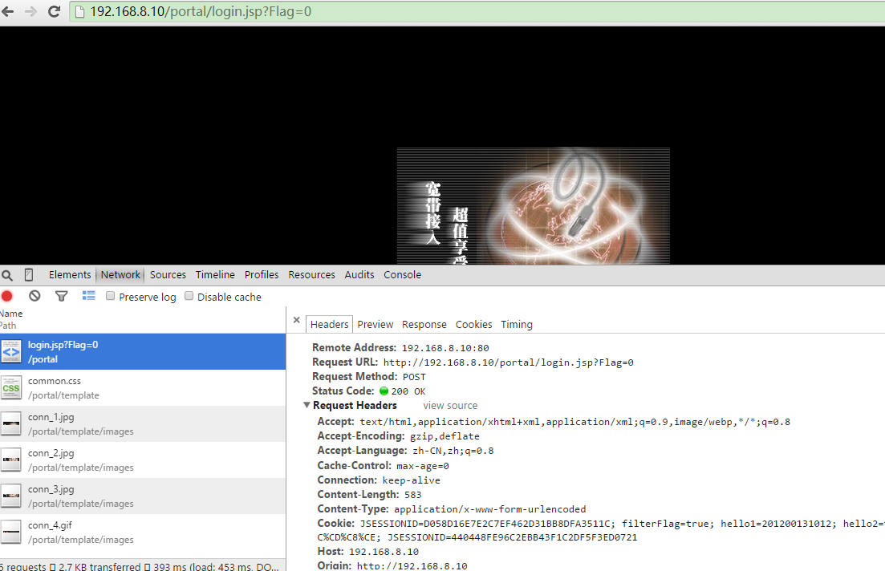
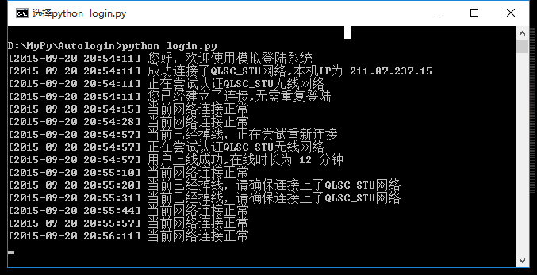

# Python爬虫实战三之实现山东大学无线网络掉线自动重连

## 综述

最近山大软件园校区QLSC_STU无线网掉线掉的厉害，连上之后平均十分钟左右掉线一次，很是让人心烦，还能不能愉快地上自习了？能忍吗？反正我是不能忍了，嗯，自己动手，丰衣足食！写个程序解决掉它！

假若你不能连这个无线，那就照照思路啦～

## 决战前夕

首先我们看一下那个验证页面是咋样滴，上个图先


嘿，这界面还算可以把，需要我们输入的东西就是俩，一个就是学号，另一个是身份证号后六位，然后就可以登录，享受免费的无线网啦。

不过不知道谁设置了个登录时长，一段时间后就会掉线了，于是，自动模拟登陆系统就要应运而生啦。

来，我们先点击一下连接，看一下浏览器怎么工作的。

按下F12，监听网络，我们点击第一个响应，也就是login.jsp，看一下。

 

我们具体看一下headers，里面form提交了什么东西，真的是茫茫多的数据啊。


嗯，一目了然POST的数据和提交的地址。 让我们来分析几个数据吧：

> 
- ClientIP：当前客户端的IP地址，在山大软件园校区这个地址是211.87开头的
- timeoutvalue：连接等待时间，也就是俗话说的timeout
- StartTime：登录时间，也就是在你登录的那一刻的时间戳，这个时间戳是13位的，精确到了毫秒，不过一般是10位的，我们加3个0就好了
- shkOvertime：登录持续时间，这个数据默认是720，也就是12分钟之后，登录就失效了，自动掉线，我们可以手动更改
- username：学号
- password：密码，也就是我们身份证号后六位

我们需要在登录的时候把form表单中的所有信息都POST一下，然后就可以完成登录啦。 万事俱备，只欠东风，来来来，程序写起来！

## 一触即发

说走咱就走啊，天上的星星参北斗啊！

登陆地址：Request URL:http://192.168.8.10/portal/login.jsp?Flag=0

首先，我们需要验证一下IP地址，先写一个获取IP地址的函数，首先判断当前IP是不是211.87开头的，如果是的话，证明连接的IP是有效的。 首先我们写一个获取本机IP的方法：

```
self.ip_pre = "211.87"    
#获取本机无线IP
    def getIP(self):
        local_iP = socket.gethostbyname(socket.gethostname())
        if self.ip_pre in str(local_iP):
            return str(local_iP)
        ip_lists = socket.gethostbyname_ex(socket.gethostname())

        for ip_list in ip_lists:
            if isinstance(ip_list, list):
                for i in ip_list:
                    if self.ip_pre in str(i):
                        return str(i)
            elif type(ip_list) is types.StringType:
                if self.ip_pre in ip_list:
                    return ip_list
```

这个方法利用了gethostbyname和gethostbyname_ex方法，获取了各个网卡的IP地址，遍历一下，找到那个211.87开头的IP，返回 接下来，获取到IP之后，我们便可以构建form，然后进行模拟登陆了。


```
#模拟登录
    def login(self):
        print self.getCurrentTime(), u"正在尝试认证QLSC_STU无线网络"
        ip = self.getIP()
        data = {
            "username": self.username,
            "password": self.password,
            "serverType": "",
            "isSavePass": "on",
            "Submit1": "",
            "Language": "Chinese",
            "ClientIP": self.getIP(),
            "timeoutvalue": 45,
            "heartbeat": 240,
            "fastwebornot": False,
            "StartTime": self.getNowTime(),
            #持续时间，超过这个时间自动掉线，可进行设置
            "shkOvertime": self.overtime,
            "strOSName": "",
            "iAdptIndex": "",
            "strAdptName": "",
            "strAdptStdName": "",
            "strFileEncoding": "",
            "PhysAddr": "",
            "bDHCPEnabled": "",
            "strIPAddrArray": "",
            "strMaskArray": "",
            "strMask": "",
            "iDHCPDelayTime": "",
            "iDHCPTryTimes": "",
            "strOldPrivateIP": self.getIP(),
            "strOldPublicIP": self.getIP(),
            "strPrivateIP": self.getIP(),
            "PublicIP": self.getIP(),
            "iIPCONFIG":0,
            "sHttpPrefix": "http://192.168.8.10",
            "title": "CAMS Portal"
        }
        #消息头
        headers = {
            'User-Agent' : 'Mozilla/5.0 (Windows NT 6.3; WOW64) AppleWebKit/537.36 (KHTML, like Gecko) Chrome/38.0.2125.111 Safari/537.36',
            'Host': '192.168.8.10',
            'Origin': 'http://192.168.8.10',
            'Referer': 'http://192.168.8.10/portal/index_default.jsp?Language=Chinese'
        }
        post_data = urllib.urlencode(data)
        login_url = "http://192.168.8.10/portal/login.jsp?Flag=0"
        request = urllib2.Request(login_url, post_data, headers)
        response = urllib2.urlopen(request)
        result = response.read().decode('gbk')
```

比较多的内容就在于form表单的数据内容以及请求头，后来利用urllib2的urlopen方法实现模拟登陆。

如果大家对此不熟悉，可以参见

Urllib的基本使用

这样，登录后的结果就会保存在result变量中，我们只需要从result中提取出我们需要的数据就可以了。

## 乘胜追击

接下来，我们就分析一下数据啦，结果有这么几种：

> 
- 1.登录成功 
- 2.已经登录 
- 3.用户不存在 
- 4.密码错误 
- 5.未知错误

好，利用result分析一下结果


```
#打印登录结果
    def getLoginResult(self, result):
        if u"用户上线成功" in result:
            print self.getCurrentTime(),u"用户上线成功,在线时长为",self.overtime/60,"分钟"
        elif u"您已经建立了连接" in result:
            print self.getCurrentTime(),u"您已经建立了连接,无需重复登陆"
        elif u"用户不存在" in result:
            print self.getCurrentTime(),u"用户不存在，请检查学号是否正确"
        elif u"用户密码错误" in result:
            pattern = re.compile('<td class="tWhite">.*?2553:(.*?)</b>.*?</td>', re.S)
            res = re.search(pattern, result)
            if res:
                print self.getCurrentTime(),res.group(1),u"请重新修改密码"
        else:
            print self.getCurrentTime(),u"未知错误，请检查学号密码是否正确"
```

通过字符串匹配和正则表达式，我们分辨并提取出了上述五种情况。

增加循环检测 既然是检测网络是否断开，那么我们只需要每隔一段时间检测一下就好了，那就10秒吧。

因为这个10秒是可配置的，为了方便配置，统一配置到__init__方法里面。

```
#检测间隔时间，单位为秒
self.every = 10
```


然后，我们写一个循环来检测一下

```
while True:
            nowIP = self.getIP()
            if not nowIP:
                print self.getCurrentTime(), u"请检查是否正常连接QLSC_STU无线网络"
            else:
                print self.getCurrentTime(),u"成功连接了QLSC_STU网络,本机IP为",nowIP
                self.login()
                while True:
                    can_connect = self.canConnect()
                    if not can_connect:
                        nowIP = self.getIP()
                        if not nowIP:
                            print self.getCurrentTime(), u"当前已经断线，请确保连接上了QLSC_STU网络"
                        else:
                            print self.getCurrentTime(), u"当前已经断线，正在尝试重新连接"
                            self.login()
                    else:
                        print self.getCurrentTime(), u"当前网络连接正常"
                    time.sleep(self.every)
            time.sleep(self.every)
```

其中我们用到了canConnect方法，这个就是检测网络是否已经断开的方法，我们可以利用ping百度的方法来检测一下。

方法实现如下

```
#判断当前是否可以联网
    def canConnect(self):
        fnull = open(os.devnull, 'w')
        result = subprocess.call('ping www.baidu.com', shell = True, stdout = fnull, stderr = fnull)
        fnull.close()
        if result:
            return False
        else:
            return True
```

好啦，所有的要点我们已经逐一击破，等着凯旋吧

## 收拾战场

好了，所有的代码要点已经被我们攻破了，接下来就整理一下，让他们组合起来，变成一个应用程序吧。

```
__author__ = 'CQC'
#-*- coding:utf-8 -*-

import urllib
import urllib2
import socket
import types
import time
import re
import os
import subprocess

class Login:

    #初始化
    def __init__(self):
        #学号密码
        self.username = '201200131012'
        self.password = 'XXXXXX'
        #山大无线STU的IP网段
        self.ip_pre = '211.87'
        #登录时长
        self.overtime = 720
        #检测间隔时间，单位为秒
        self.every = 10

    #模拟登录
    def login(self):
        print self.getCurrentTime(), u"正在尝试认证QLSC_STU无线网络"
        ip = self.getIP()
        data = {
            "username": self.username,
            "password": self.password,
            "serverType": "",
            "isSavePass": "on",
            "Submit1": "",
            "Language": "Chinese",
            "ClientIP": self.getIP(),
            "timeoutvalue": 45,
            "heartbeat": 240,
            "fastwebornot": False,
            "StartTime": self.getNowTime(),
            #持续时间，超过这个时间自动掉线，可进行设置
            "shkOvertime": self.overtime,
            "strOSName": "",
            "iAdptIndex": "",
            "strAdptName": "",
            "strAdptStdName": "",
            "strFileEncoding": "",
            "PhysAddr": "",
            "bDHCPEnabled": "",
            "strIPAddrArray": "",
            "strMaskArray": "",
            "strMask": "",
            "iDHCPDelayTime": "",
            "iDHCPTryTimes": "",
            "strOldPrivateIP": self.getIP(),
            "strOldPublicIP": self.getIP(),
            "strPrivateIP": self.getIP(),
            "PublicIP": self.getIP(),
            "iIPCONFIG":0,
            "sHttpPrefix": "http://192.168.8.10",
            "title": "CAMS Portal"
        }
        #消息头
        headers = {
            'User-Agent' : 'Mozilla/5.0 (Windows NT 6.3; WOW64) AppleWebKit/537.36 (KHTML, like Gecko) Chrome/38.0.2125.111 Safari/537.36',
            'Host': '192.168.8.10',
            'Origin': 'http://192.168.8.10',
            'Referer': 'http://192.168.8.10/portal/index_default.jsp?Language=Chinese'
        }
        post_data = urllib.urlencode(data)
        login_url = "http://192.168.8.10/portal/login.jsp?Flag=0"
        request = urllib2.Request(login_url, post_data, headers)
        response = urllib2.urlopen(request)
        result = response.read().decode('gbk')
        self.getLoginResult(result)


    #打印登录结果
    def getLoginResult(self, result):
        if u"用户上线成功" in result:
            print self.getCurrentTime(),u"用户上线成功,在线时长为",self.overtime/60,"分钟"
        elif u"您已经建立了连接" in result:
            print self.getCurrentTime(),u"您已经建立了连接,无需重复登陆"
        elif u"用户不存在" in result:
            print self.getCurrentTime(),u"用户不存在，请检查学号是否正确"
        elif u"用户密码错误" in result:
            pattern = re.compile('<td class="tWhite">.*?2553:(.*?)</b>.*?</td>', re.S)
            res = re.search(pattern, result)
            if res:
                print self.getCurrentTime(),res.group(1),u"请重新修改密码"
        else:
            print self.getCurrentTime(),u"未知错误，请检查学号密码是否正确"

    #获取当前时间戳，13位
    def getNowTime(self):
        return str(int(time.time()))+"000"

    #获取本机无线IP
    def getIP(self):
        local_iP = socket.gethostbyname(socket.gethostname())
        if self.ip_pre in str(local_iP):
            return str(local_iP)
        ip_lists = socket.gethostbyname_ex(socket.gethostname())

        for ip_list in ip_lists:
            if isinstance(ip_list, list):
                for i in ip_list:
                    if self.ip_pre in str(i):
                        return str(i)
            elif type(ip_list) is types.StringType:
                if self.ip_pre in ip_list:
                    return ip_list

    #判断当前是否可以联网
    def canConnect(self):
        fnull = open(os.devnull, 'w')
        result = subprocess.call('ping www.baidu.com', shell = True, stdout = fnull, stderr = fnull)
        fnull.close()
        if result:
            return False
        else:
            return True

    #获取当前时间
    def getCurrentTime(self):
        return time.strftime('[%Y-%m-%d %H:%M:%S]',time.localtime(time.time()))

    #主函数
    def main(self):
        print self.getCurrentTime(), u"您好，欢迎使用模拟登陆系统"
        while True:
            nowIP = self.getIP()
            if not nowIP:
                print self.getCurrentTime(), u"请检查是否正常连接QLSC_STU无线网络"
            else:
                print self.getCurrentTime(),u"成功连接了QLSC_STU网络,本机IP为",nowIP
                self.login()
                while True:
                    can_connect = self.canConnect()
                    if not can_connect:
                        nowIP = self.getIP()
                        if not nowIP:
                            print self.getCurrentTime(), u"当前已经掉线，请确保连接上了QLSC_STU网络"
                        else:
                            print self.getCurrentTime(), u"当前已经掉线，正在尝试重新连接"
                            self.login()
                    else:
                        print self.getCurrentTime(), u"当前网络连接正常"
                    time.sleep(self.every)
            time.sleep(self.every)

login = Login()
login.main()
```

来，我们来运行一下，看下效果吧！ 执行

```
python login.py
```

当前是可以联网的，我分别在网页上操作执行了断开，操作，程序自动检测到掉线，自动重新连接。

接下来我直接断开了QLSC_STU网络的链接，程序同样检测到QLSC_STU这个热点没有连接上，提示用户链接。

接下来我重新连接上了这个热点，由于刚才已经登录上线，且持续时间较短，网络自动恢复正常。

下面是运行结果：



嗯，这样我们就是实现了自动掉线的检测和模拟登录。

## 凯旋而归

咿呀伊尔哟，想约妹子上自习吗？那就赶紧来试试吧！一网在手，天下我有！追男神女神都不再是梦想！

如果有问题，欢迎留言讨论，代码肯定有不完善的地方，仅供参考。