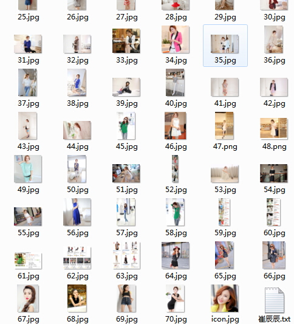

# Python爬虫实战四之抓取淘宝MM照片

福利啊福利，本次为大家带来的项目是抓取淘宝MM照片并保存起来，大家有没有很激动呢？

## 最新动态

> 更新时间：2015/8/2
最近好多读者反映代码已经不能用了，原因是淘宝索引页的MM链接改了。网站改版了，URL的索引已经和之前的不一样了，之前可以直接跳转到每个MM的个性域名，现在中间加了一个跳转页，本以为可以通过这个页面然后跳转到原来的个性域名，而经过一番折腾发现，这个跳转页中的内容是JS动态生成的，所以不能用Urllib库来直接抓取了，本篇就只提供学习思路，代码不能继续用了。
之后博主会利用其它方法来尝试解决，如果解决，第一时间更新！谢谢大家！

> 更新时间：2016/3/26
如上问题已解决，利用 PhantomJS的动态解析即可完成。因为 PySpider 同样支持 PhantomJS，所以我直接利用了 PySpider 来完成，解决方案如下
[解决方案](http://cuiqingcai.com/2652.html)
另外如果不想使用框架，可以直接利用 Selenium + PhantomJS 来解析，同样方便，解决方案可以参考
[动态解析解决方案](http://cuiqingcai.com/2599.html)

## 本篇目标

1.抓取淘宝MM的姓名，头像，年龄

2.抓取每一个MM的资料简介以及写真图片

3.把每一个MM的写真图片按照文件夹保存到本地

4.熟悉文件保存的过程

## 1.URL的格式

在这里我们用到的URL是 http://mm.taobao.com/json/request_top_list.htm?page=1，问号前面是基地址，后面的参数page是代表第几页，可以随意更换地址。点击开之后，会发现有一些淘宝MM的简介，并附有超链接链接到个人详情页面。

我们需要抓取本页面的头像地址，MM姓名，MM年龄，MM居住地，以及MM的个人详情页面地址。

## 2.抓取简要信息

相信大家经过上几次的实战，对抓取和提取页面的地址已经非常熟悉了，这里没有什么难度了，我们首先抓取本页面的MM详情页面地址，姓名，年龄等等的信息打印出来，直接贴代码如下

```
__author__ = 'CQC'
# -*- coding:utf-8 -*-

import urllib
import urllib2
import re

class Spider:

    def __init__(self):
        self.siteURL = 'http://mm.taobao.com/json/request_top_list.htm'

    def getPage(self,pageIndex):
        url = self.siteURL + "?page=" + str(pageIndex)
        print url
        request = urllib2.Request(url)
        response = urllib2.urlopen(request)
        return response.read().decode('gbk')

    def getContents(self,pageIndex):
        page = self.getPage(pageIndex)
        pattern = re.compile('<div class="list-item".*?pic-word.*?<a href="(.*?)".*?(.*?)</a>.*?<strong>(.*?)</strong>.*?<span>(.*?)</span>',re.S)
        items = re.findall(pattern,page)
        for item in items:
            print item[0],item[1],item[2],item[3],item[4]

spider = Spider()
spider.getContents(1)
```

运行结果如下


## 2.文件写入简介

在这里，我们有写入图片和写入文本两种方式

### 1）写入图片

```
#传入图片地址，文件名，保存单张图片
def saveImg(self,imageURL,fileName):
     u = urllib.urlopen(imageURL)
     data = u.read()
     f = open(fileName, 'wb')
     f.write(data)
     f.close()
```

### 2）写入文本

```
def saveBrief(self,content,name):
    fileName = name + "/" + name + ".txt"
    f = open(fileName,"w+")
    print u"正在偷偷保存她的个人信息为",fileName
    f.write(content.encode('utf-8'))
```

### 3）创建新目录

```
#创建新目录
def mkdir(self,path):
    path = path.strip()
    # 判断路径是否存在
    # 存在     True
    # 不存在   False
    isExists=os.path.exists(path)
    # 判断结果
    if not isExists:
        # 如果不存在则创建目录
        # 创建目录操作函数
        os.makedirs(path)
        return True
    else:
        # 如果目录存在则不创建，并提示目录已存在
        return False
```

## 3.代码完善

主要的知识点已经在前面都涉及到了，如果大家前面的章节都已经看了，完成这个爬虫不在话下，具体的详情在此不再赘述，直接帖代码啦。

```
spider.py
```

```
__author__ = 'CQC'
# -*- coding:utf-8 -*-

import urllib
import urllib2
import re
import tool
import os

#抓取MM
class Spider:

    #页面初始化
    def __init__(self):
        self.siteURL = 'http://mm.taobao.com/json/request_top_list.htm'
        self.tool = tool.Tool()

    #获取索引页面的内容
    def getPage(self,pageIndex):
        url = self.siteURL + "?page=" + str(pageIndex)
        request = urllib2.Request(url)
        response = urllib2.urlopen(request)
        return response.read().decode('gbk')

    #获取索引界面所有MM的信息，list格式
    def getContents(self,pageIndex):
        page = self.getPage(pageIndex)
        pattern = re.compile('<div class="list-item".*?pic-word.*?<a href="(.*?)".*?(.*?)</a>.*?<strong>(.*?)</strong>.*?<span>(.*?)</span>',re.S)
        items = re.findall(pattern,page)
        contents = []
        for item in items:
            contents.append([item[0],item[1],item[2],item[3],item[4]])
        return contents

    #获取MM个人详情页面
    def getDetailPage(self,infoURL):
        response = urllib2.urlopen(infoURL)
        return response.read().decode('gbk')

    #获取个人文字简介
    def getBrief(self,page):
        pattern = re.compile('<div class="mm-aixiu-content".*?>(.*?)<!--',re.S)
        result = re.search(pattern,page)
        return self.tool.replace(result.group(1))

    #获取页面所有图片
    def getAllImg(self,page):
        pattern = re.compile('<div class="mm-aixiu-content".*?>(.*?)<!--',re.S)
        #个人信息页面所有代码
        content = re.search(pattern,page)
        #从代码中提取图片
        patternImg = re.compile(' 3:
                fTail = "jpg"
            fileName = name + "/" + str(number) + "." + fTail
            self.saveImg(imageURL,fileName)
            number += 1

    # 保存头像
    def saveIcon(self,iconURL,name):
        splitPath = iconURL.split('.')
        fTail = splitPath.pop()
        fileName = name + "/icon." + fTail
        self.saveImg(iconURL,fileName)

    #保存个人简介
    def saveBrief(self,content,name):
        fileName = name + "/" + name + ".txt"
        f = open(fileName,"w+")
        print u"正在偷偷保存她的个人信息为",fileName
        f.write(content.encode('utf-8'))


    #传入图片地址，文件名，保存单张图片
    def saveImg(self,imageURL,fileName):
         u = urllib.urlopen(imageURL)
         data = u.read()
         f = open(fileName, 'wb')
         f.write(data)
         print u"正在悄悄保存她的一张图片为",fileName
         f.close()

    #创建新目录
    def mkdir(self,path):
        path = path.strip()
        # 判断路径是否存在
        # 存在     True
        # 不存在   False
        isExists=os.path.exists(path)
        # 判断结果
        if not isExists:
            # 如果不存在则创建目录
            print u"偷偷新建了名字叫做",path,u'的文件夹'
            # 创建目录操作函数
            os.makedirs(path)
            return True
        else:
            # 如果目录存在则不创建，并提示目录已存在
            print u"名为",path,'的文件夹已经创建成功'
            return False

    #将一页淘宝MM的信息保存起来
    def savePageInfo(self,pageIndex):
        #获取第一页淘宝MM列表
        contents = self.getContents(pageIndex)
        for item in contents:
            #item[0]个人详情URL,item[1]头像URL,item[2]姓名,item[3]年龄,item[4]居住地
            print u"发现一位模特,名字叫",item[2],u"芳龄",item[3],u",她在",item[4]
            print u"正在偷偷地保存",item[2],"的信息"
            print u"又意外地发现她的个人地址是",item[0]
            #个人详情页面的URL
            detailURL = item[0]
            #得到个人详情页面代码
            detailPage = self.getDetailPage(detailURL)
            #获取个人简介
            brief = self.getBrief(detailPage)
            #获取所有图片列表
            images = self.getAllImg(detailPage)
            self.mkdir(item[2])
            #保存个人简介
            self.saveBrief(brief,item[2])
            #保存头像
            self.saveIcon(item[1],item[2])
            #保存图片
            self.saveImgs(images,item[2])

    #传入起止页码，获取MM图片
    def savePagesInfo(self,start,end):
        for i in range(start,end+1):
            print u"正在偷偷寻找第",i,u"个地方，看看MM们在不在"
            self.savePageInfo(i)


#传入起止页码即可，在此传入了2,10,表示抓取第2到10页的MM
spider = Spider()
spider.savePagesInfo(2,10)
```

```
tool.py
```

```
__author__ = 'CQC'
#-*- coding:utf-8 -*-
import re

#处理页面标签类
class Tool:
    #去除img标签,1-7位空格,&nbsp;
    removeImg = re.compile('| {1,7}|&nbsp;')
    #删除超链接标签
    removeAddr = re.compile('<a.*?>|</a>')
    #把换行的标签换为\n
    replaceLine = re.compile('<tr>|<div>|</div>|</p>')
    #将表格制表<td>替换为\t
    replaceTD= re.compile('<td>')
    #将换行符或双换行符替换为\n
    replaceBR = re.compile('<br><br>|<br>')
    #将其余标签剔除
    removeExtraTag = re.compile('<.*?>')
    #将多行空行删除
    removeNoneLine = re.compile('\n+')
    def replace(self,x):
        x = re.sub(self.removeImg,"",x)
        x = re.sub(self.removeAddr,"",x)
        x = re.sub(self.replaceLine,"\n",x)
        x = re.sub(self.replaceTD,"\t",x)
        x = re.sub(self.replaceBR,"\n",x)
        x = re.sub(self.removeExtraTag,"",x)
        x = re.sub(self.removeNoneLine,"\n",x)
        #strip()将前后多余内容删除
        return x.strip()
```

以上两个文件就是所有的代码内容，运行一下试试看，那叫一个酸爽啊


看看文件夹里面有什么变化


 


不知不觉，海量的MM图片已经进入了你的电脑，还不快快去试试看！！

代码均为本人所敲，写的不好，大神勿喷，写来方便自己，同时分享给大家参考！希望大家支持！