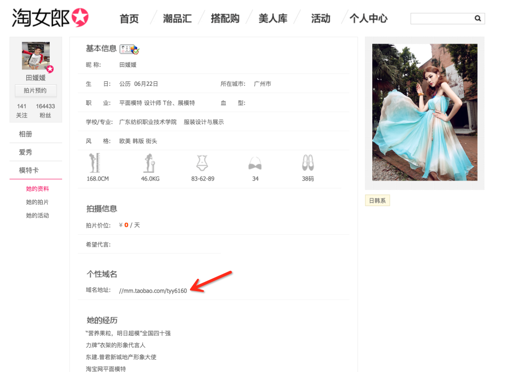
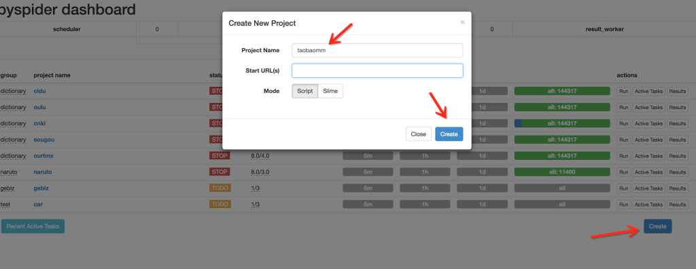
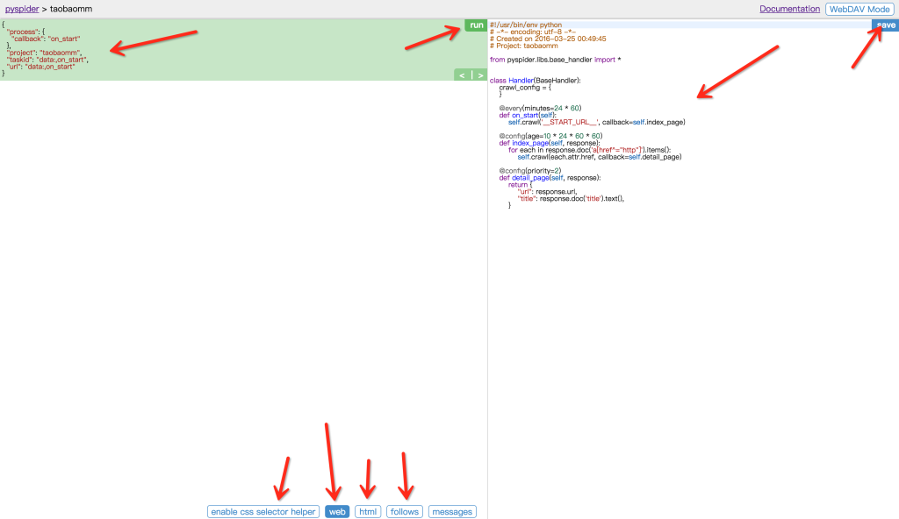
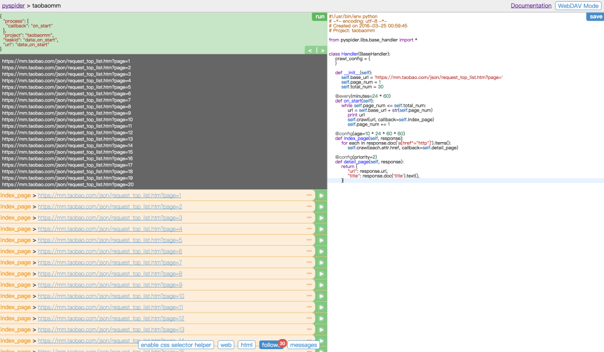
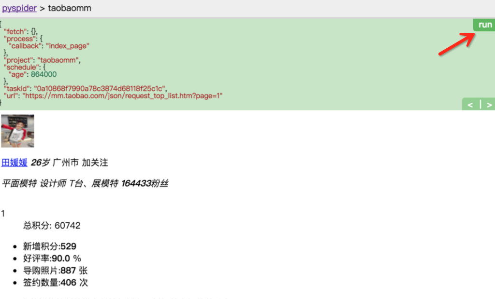
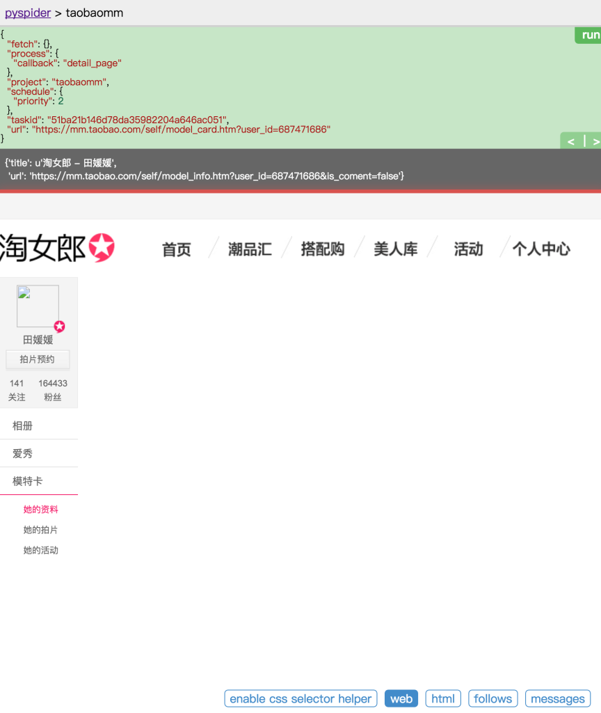
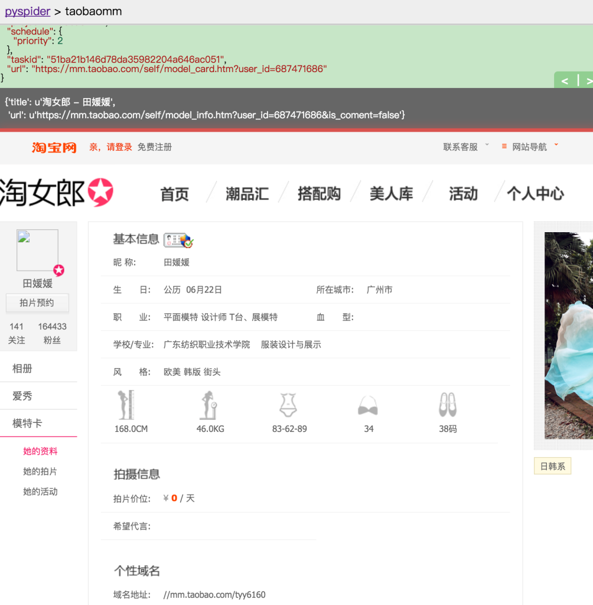
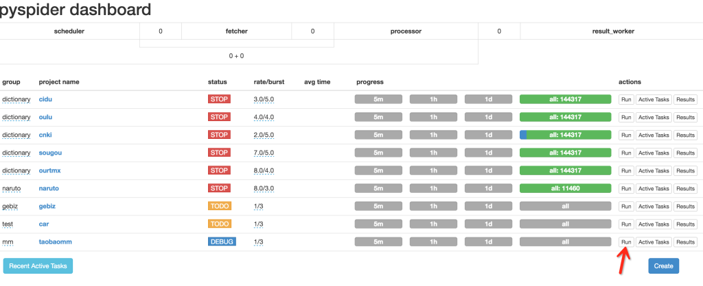
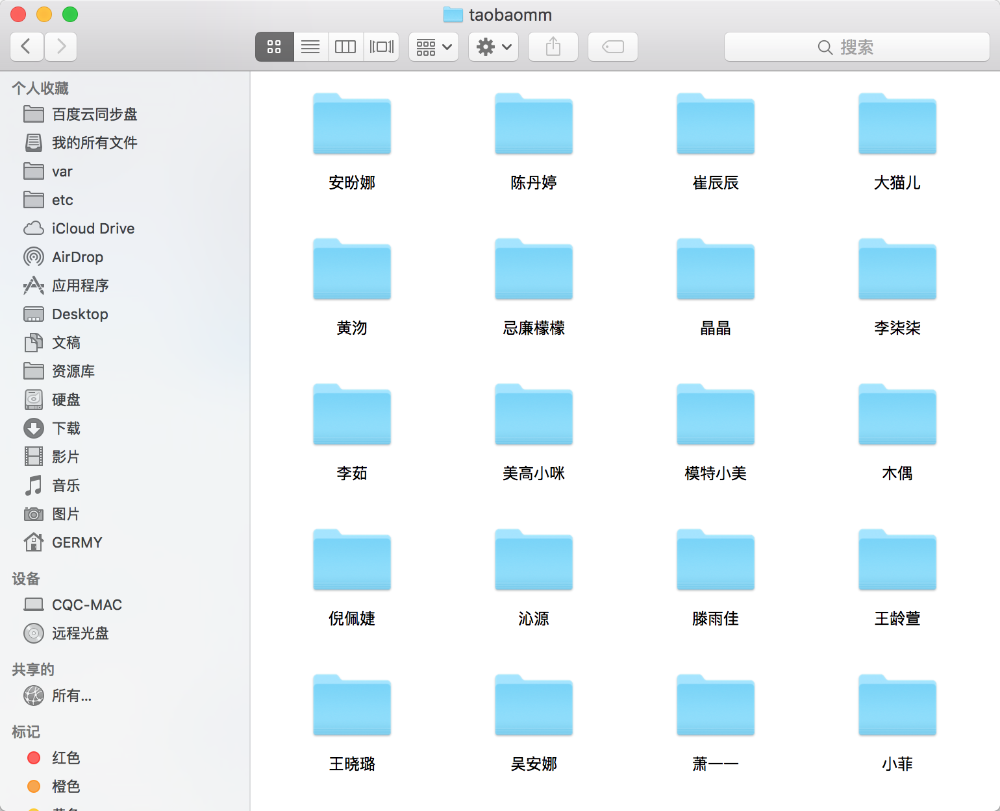

# Python爬虫进阶四之PySpider的用法


## 审时度势

PySpider 是一个我个人认为非常方便并且功能强大的爬虫框架，支持多线程爬取、JS动态解析，提供了可操作界面、出错重试、定时爬取等等的功能，使用非常人性化。

本篇内容通过跟我做一个好玩的 PySpider 项目，来理解 PySpider 的运行流程。

## 招兵买马

具体的[安装过程](http://cuiqingcai.com/2443.html)请查看本节讲述

嗯，安装好了之后就与我大干一番吧。

## 鸿鹄之志

我之前写过的一篇文章[抓取淘宝MM照片](http://cuiqingcai.com/1001.html)

由于网页改版，爬取过程中需要的 URL 需要 JS 动态解析生成，所以之前用的 urllib2 不能继续使用了，在这里我们利用 PySpider 重新实现一下。

所以现在我们需要做的是抓取淘宝MM的个人信息和图片存储到本地。

## 审时度势

爬取目标网站：https://mm.taobao.com/json/request_top_list.htm?page=1，大家打开之后可以看到许多淘宝MM的列表。

列表有多少？

https://mm.taobao.com/json/request_top_list.htm?page=10000，第10000页都有，看你想要多少。我什么也不知道。

随机点击一位 MM 的姓名，可以看到她的基本资料。



可以看到图中有一个个性域名，我们复制到浏览器打开。mm.taobao.com/tyy6160


 
嗯，往下拖，海量的 MM 图片都在这里了，怎么办你懂得，我们要把她们的照片和个人信息都存下来。

P.S. 注意图中进度条！你猜有多少图片～

## 利剑出鞘

安装成功之后，跟我一步步地完成一个网站的抓取，你就会明白 PySpider 的基本用法了。

命令行下执行

```
pyspider all
```

这句命令的意思是，运行 pyspider 并 启动它的所有组件。


 

可以发现程序已经正常启动，并在 5000 这个端口运行。

## 一触即发

接下来在浏览器中输入 http://localhost:5000，可以看到 PySpider 的主界面，点击右下角的 Create，命名为 taobaomm，当然名称你可以随意取，继续点击 Create。



这样我们会进入到一个爬取操作的页面。



整个页面分为两栏，左边是爬取页面预览区域，右边是代码编写区域。下面对区块进行说明：

左侧绿色区域：这个请求对应的 JSON 变量，在 PySpider 中，其实每个请求都有与之对应的 JSON 变量，包括回调函数，方法名，请求链接，请求数据等等。

绿色区域右上角Run：点击右上角的 run 按钮，就会执行这个请求，可以在左边的白色区域出现请求的结果。

左侧 enable css selector helper: 抓取页面之后，点击此按钮，可以方便地获取页面中某个元素的 CSS 选择器。

左侧 web: 即抓取的页面的实时预览图。

左侧 html: 抓取页面的 HTML 代码。

左侧 follows: 如果当前抓取方法中又新建了爬取请求，那么接下来的请求就会出现在 follows 里。

左侧 messages: 爬取过程中输出的一些信息。

右侧代码区域: 你可以在右侧区域书写代码，并点击右上角的 Save 按钮保存。

右侧 WebDAV Mode: 打开调试模式，左侧最大化，便于观察调试。

## 乘胜追击

依然是上一节的那个网址，https://mm.taobao.com/json/request_top_list.htm?page=1，其中 page 参数代表页码。所以我们暂时抓取前 30 页。页码到最后可以随意调整。

首先我们定义基地址，然后定义爬取的页码和总页码。

```
from pyspider.libs.base_handler import *


class Handler(BaseHandler):
    crawl_config = {
    }
    
    def __init__(self):
        self.base_url = 'https://mm.taobao.com/json/request_top_list.htm?page='
        self.page_num = 1
        self.total_num = 30

    @every(minutes=24 * 60)
    def on_start(self):
        while self.page_num <= self.total_num:
            url = self.base_url + str(self.page_num)
            print url
            self.crawl(url, callback=self.index_page)
            self.page_num += 1

    @config(age=10 * 24 * 60 * 60)
    def index_page(self, response):
        for each in response.doc('a[href^="http"]').items():
            self.crawl(each.attr.href, callback=self.detail_page)

    @config(priority=2)
    def detail_page(self, response):
        return {
            "url": response.url,
            "title": response.doc('title').text(),
        }
```


点击 save 保存代码，然后点击左边的 run，运行代码。



运行后我们会发现 follows 出现了 30 这个数字，说明我们接下来有 30 个新请求，点击可查看所有爬取列表。另外控制台也有输出，将所有要爬取的 URL 打印了出来。

然后我们点击左侧任意一个绿色箭头，可以继续爬取这个页面。例如点击第一个 URL，来爬取这个 URL


点击之后，再查看下方的 web 页面，可以预览实时页面，这个页面被我们爬取了下来，并且回调到 index_page 函数来处理，目前 index_page 函数我们还没有处理，所以是继续构件了所有的链接请求。


好，接下来我们怎么办？当然是进入到 MM 到个人页面去爬取了。

## 如火如荼

爬取到了 MM 的列表，接下来就要进入到 MM 详情页了，修改 index_page 方法。

```
def index_page(self, response):
    for each in response.doc('.lady-name').items():
        self.crawl(each.attr.href, callback=self.detail_page)
```

其中 response 就是刚才爬取的列表页，response 其实就相当于列表页的 html 代码，利用 doc 函数，其实是调用了 PyQuery，用 CSS 选择器得到每一个MM的链接，然后重新发起新的请求。

比如，我们这里拿到的 each.attr.href 可能是 mm.taobao.com/self/model_card.htm?user_id=687471686，在这里继续调用了 crawl 方法，代表继续抓取这个链接的详情。

```
self.crawl(each.attr.href, callback=self.detail_page)
```

然后回调函数就是 detail_page，爬取的结果会作为 response 变量传过去。detail_page 接到这个变量继续下面的分析。



好，我们继续点击 run 按钮，开始下一个页面的爬取。得到的结果是这样的。



哦，有些页面没有加载出来，这是为什么？

在之前的文章说过，这个页面比较特殊，右边的页面使用 JS 渲染生成的，而普通的抓取是不能得到 JS 渲染后的页面的，这可麻烦了。

然而，幸运的是，PySpider 提供了动态解析 JS 的机制。

友情提示：可能有的小伙伴不知道 PhantomJS，可以参考[爬虫JS动态解析](http://cuiqingcai.com/2599.html)

因为我们在前面装好了 PhantomJS，所以，这时候就轮到它来出场了。在最开始运行 PySpider 的时候，使用了pyspider all命令，这个命令是把 PySpider 所有的组件启动起来，其中也包括 PhantomJS。

所以我们代码怎么改呢？很简单。

```
def index_page(self, response):
    for each in response.doc('.lady-name').items():
        self.crawl(each.attr.href, callback=self.detail_page, fetch_type='js')
```

只是简单地加了一个 fetch_type=’js’，点击绿色的返回箭头，重新运行一下。

可以发现，页面已经被我们成功加载出来了，简直不能更帅！



看下面的个性域名，所有我们需要的 MM 图片都在那里面了，所以我们需要继续抓取这个页面。

## 胜利在望

好，继续修改 detail_page 方法，然后增加一个 domain_page 方法，用来处理每个 MM 的个性域名。

```
def detail_page(self, response):
    domain = 'https:' + response.doc('.mm-p-domain-info li > span').text()
    print domain
    self.crawl(domain, callback=self.domain_page)
                
def domain_page(self, response):
    pass
```

好，继续重新 run，预览一下页面，终于，我们看到了 MM 的所有图片。


嗯，你懂得！

## 只欠东风

好，照片都有了，那么我们就偷偷地下载下来吧～

完善 domain_page 代码，实现保存简介和遍历保存图片的方法。

在这里，PySpider 有一个特点，所有的 request 都会保存到一个队列中，并具有去重和自动重试机制。所以，我们最好的解决方法是，把每张图片的请求都写成一个 request，然后成功后用文件写入即可，这样会避免图片加载不全的问题。

曾经在之前文章写过图片下载和文件夹创建的过程，在这里就不多赘述原理了，直接上写好的工具类，后面会有完整代码。

```
import os

class Deal:
    def __init__(self):
        self.path = DIR_PATH
        if not self.path.endswith('/'):
            self.path = self.path + '/'
        if not os.path.exists(self.path):
            os.makedirs(self.path)

    def mkDir(self, path):
        path = path.strip()
        dir_path = self.path + path
        exists = os.path.exists(dir_path)
        if not exists:
            os.makedirs(dir_path)
            return dir_path
        else:
            return dir_path

    def saveImg(self, content, path):
        f = open(path, 'wb')
        f.write(content)
        f.close()

    def saveBrief(self, content, dir_path, name):
        file_name = dir_path + "/" + name + ".txt"
        f = open(file_name, "w+")
        f.write(content.encode('utf-8'))

    def getExtension(self, url):
        extension = url.split('.')[-1]
        return extension
```

这里面包含了四个方法。

> mkDir：创建文件夹，用来创建 MM 名字对应的文件夹。
saveBrief: 保存简介，保存 MM 的文字简介。
saveImg: 传入图片二进制流以及保存路径，存储图片。
getExtension: 获得链接的后缀名，通过图片 URL 获得。
然后在 domain_page 中具体实现如下

```
def domain_page(self, response):
    name = response.doc('.mm-p-model-info-left-top dd > a').text()
    dir_path = self.deal.mkDir(name)
    brief = response.doc('.mm-aixiu-content').text()
    if dir_path:
        imgs = response.doc('.mm-aixiu-content img').items()
        count = 1
        self.deal.saveBrief(brief, dir_path, name)
        for img in imgs:
            url = img.attr.src
            if url:
                extension = self.deal.getExtension(url)
                file_name = name + str(count) + '.' + extension
                count += 1
                self.crawl(img.attr.src, callback=self.save_img,
                           save={'dir_path': dir_path, 'file_name': file_name})

def save_img(self, response):
    content = response.content
    dir_path = response.save['dir_path']
    file_name = response.save['file_name']
    file_path = dir_path + '/' + file_name
    self.deal.saveImg(content, file_path)
```

以上方法首先获取了页面的所有文字，然后调用了 saveBrief 方法存储简介。

然后遍历了 MM 所有的图片，并通过链接获取后缀名，和 MM 的姓名以及自增计数组合成一个新的文件名，调用 saveImg 方法保存图片。

## 炉火纯青

好，基本的东西都写好了。

接下来。继续完善一下代码。第一版本完成。

版本一功能：按照淘宝MM姓名分文件夹，存储MM的 txt 文本简介以及所有美图至本地。

可配置项：

> 
PAGE_START: 列表开始页码
PAGE_END: 列表结束页码
DIR_PATH: 资源保存路径

```
#!/usr/bin/env python
# -*- encoding: utf-8 -*-
# Created on 2016-03-25 00:59:45
# Project: taobaomm

from pyspider.libs.base_handler import *

PAGE_START = 1
PAGE_END = 30
DIR_PATH = '/var/py/mm'


class Handler(BaseHandler):
    crawl_config = {
    }

    def __init__(self):
        self.base_url = 'https://mm.taobao.com/json/request_top_list.htm?page='
        self.page_num = PAGE_START
        self.total_num = PAGE_END
        self.deal = Deal()

    def on_start(self):
        while self.page_num <= self.total_num:
            url = self.base_url + str(self.page_num)
            self.crawl(url, callback=self.index_page)
            self.page_num += 1

    def index_page(self, response):
        for each in response.doc('.lady-name').items():
            self.crawl(each.attr.href, callback=self.detail_page, fetch_type='js')

    def detail_page(self, response):
        domain = response.doc('.mm-p-domain-info li > span').text()
        if domain:
            page_url = 'https:' + domain
            self.crawl(page_url, callback=self.domain_page)

    def domain_page(self, response):
        name = response.doc('.mm-p-model-info-left-top dd > a').text()
        dir_path = self.deal.mkDir(name)
        brief = response.doc('.mm-aixiu-content').text()
        if dir_path:
            imgs = response.doc('.mm-aixiu-content img').items()
            count = 1
            self.deal.saveBrief(brief, dir_path, name)
            for img in imgs:
                url = img.attr.src
                if url:
                    extension = self.deal.getExtension(url)
                    file_name = name + str(count) + '.' + extension
                    count += 1
                    self.crawl(img.attr.src, callback=self.save_img,
                               save={'dir_path': dir_path, 'file_name': file_name})

    def save_img(self, response):
        content = response.content
        dir_path = response.save['dir_path']
        file_name = response.save['file_name']
        file_path = dir_path + '/' + file_name
        self.deal.saveImg(content, file_path)


import os

class Deal:
    def __init__(self):
        self.path = DIR_PATH
        if not self.path.endswith('/'):
            self.path = self.path + '/'
        if not os.path.exists(self.path):
            os.makedirs(self.path)

    def mkDir(self, path):
        path = path.strip()
        dir_path = self.path + path
        exists = os.path.exists(dir_path)
        if not exists:
            os.makedirs(dir_path)
            return dir_path
        else:
            return dir_path

    def saveImg(self, content, path):
        f = open(path, 'wb')
        f.write(content)
        f.close()

    def saveBrief(self, content, dir_path, name):
        file_name = dir_path + "/" + name + ".txt"
        f = open(file_name, "w+")
        f.write(content.encode('utf-8'))

    def getExtension(self, url):
        extension = url.split('.')[-1]
        return extension
```

粘贴到你的 PySpider 中运行吧～

其中有一些知识点，我会在后面作详细的用法总结。大家可以先体会一下代码。



保存之后，点击下方的 run，你会发现，海量的 MM 图片已经涌入你的电脑啦～




需要解释？需要我也不解释！

## 项目代码

[TaobaoMM – GitHub](https://github.com/cqcre/TaobaoMM)

## 尚方宝剑

如果想了解 PySpider 的更多内容，可以查看[官方文档](http://docs.pyspider.org/en/latest/Quickstart/)。
