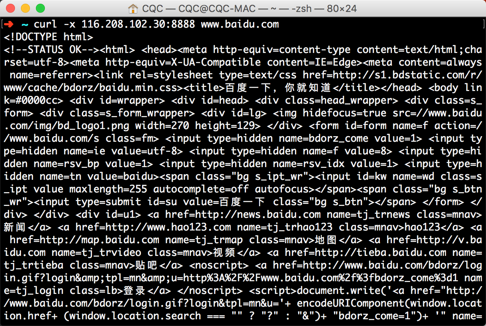
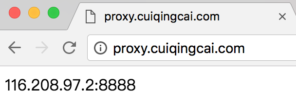

# Python爬虫进阶七之设置ADSL拨号服务器代理

## 那夜

那是一个寂静的深夜，科比还没起床练球，虽然他真的可能不练了。

我废了好大劲，爬虫终于写好了！BUG也全部调通了！心想，终于可以坐享其成了！

泡杯茶，安静地坐在椅子上看着屏幕上一行行文字在控制台跳出，一条条数据嗖嗖进入我的数据库，一张张图片悄悄存入我的硬盘。人生没有几个比这更惬意的事情了。

我端起茶杯，抿了一口，静静地回味着茶香。

这时，什么情况！屏幕爆红了！爆红了！一口茶的功夫啊喂！

怎么回事！咋爬不动了，不动了！我用浏览器点开那一个个报错的链接，浏览器显示

> 您的请求过于频繁，IP已经被暂时封禁，请稍后再试！

沃日，我IP被封了？此时此刻，空气凝固了，茶也不再香了，请给我一个爱的抱抱啊。

时候不早了，还是洗洗睡吧。

## 次日

那一晚，辗转反侧难以入睡。

怎么办？怎么办？如果是你你该怎么办？

手动换个IP？得了吧，一会又要封了，还能不能安心睡觉啊？

找免费代理？可行，不过我之前测过不少免费代理IP，一大半都不好用，而且慢。不过可以一直维护一个代理池，定时更新。

买代理？可以可以，不过优质的代理服务商价格可是不菲的，我买过一些廉价的，比如几块钱套餐一次提取几百IP的，算了还是不说了都是泪。

然而最行之有效的方法是什么？那当然是ADSL拨号！

这是个啥？且听我慢慢道来。

## 什么是ADSL

ADSL （Asymmetric Digital Subscriber Line ，非对称数字用户环路）是一种新的数据传输方式。它因为上行和下行带宽不对称，因此称为非对称数字用户线环路。它采用频分复用技术把普通的电话线分成了电话、上行和下行三个相对独立的信道，从而避免了相互之间的干扰。

他有个独有的特点，每拨一次号，就获取一个新的IP。也就是它的IP是不固定的，不过既然是拨号上网嘛，速度也是有保障的，用它搭建一个代理，那既能保证可用，又能自由控制拨号切换。

如果你是用的ADSL上网方式，那就不用过多设置了，直接自己电脑调用一个拨号命令就好了，自动换IP，分分钟解决封IP的事。

然而，你可能说？我家宽带啊，我连得公司无线啊，我蹭的网上的啊！那咋办？

这时，你就需要一台VPS拨号主机。

## 购买服务器

某度广告做的那么好是吧？一搜一片，这点谷歌可是远远比不上啊。

于是乎，我就搜了搜，键入：拨号服务器，有什么骑士互联啊、无极网络啊、挂机宝啊等等的。我选了个价钱还凑合的，选了个无极网络（这里不是在打广告），80一个月的配置，一天两块钱多点。

2核、512M内存，10M带宽。

[云立方](http://www.yunlifang.cn/)

大家觉得有更便宜的更好用请告诉我呀！

接下来开始装操作系统，进入后台，有一个自助装系统的页面。


我装的CentOS的，在后面设置代理啊，定时任务啊，远程SSH管理啊之类的比较方便。如果你想用Windows，能配置好代理那也没问题。

有的小伙伴可能会问了，既然它的IP是拨号变化的，你咋用SSH连？其实服务商提供了一个域名，做了动态解析和端口映射，映射到这台主机的22端口就好了，所以不用担心IP变化导致SSH断开的问题。

好了装好了服务器之后，服务商提供了一个ADSL的拨号操作过程，用pppoe命令都可以完成，如果你的是Linux的主机一般都是用这个。然后服务商还会给给你一个拨号账号和密码。

那么接下来就是试下拨号了。

服务商会提供详细的拨号流程说明。

比如无极的是这样的：[拨号流程](http://cloud.871020.com/vpsadm/pppoe.html)

设置好了之后，就有几个关键命令：

```
pppoe-start 拨号
pppoe-stop  断开拨号
pppoe-status 拨号连接状态
```

如果想重新拨号，那就执行stop、start就可以了。

反复执行，然后查看下ip地址，你会发现拨号一次换一个IP，是不是爽翻了！

好，那接下来就设置代理吧。

## 设置代理服务器

之前总是用别人的代理，没自己设置过吧？那么接下来我们就来亲自搭建HTTP代理。

Linux下搭建HTTP代理，推荐Squid和TinyProxy。都非常好配置，你想用哪个都行，且听我慢慢道来。

我的系统是CentOS，以它为例进行说明。

### Squid

首先利用yum安装squid

```
yum -y install squid
```

设置开机启动

```
chkconfig --level 35 squid on
```

修改配置文件

```
vi /etc/squid/squid.conf
```

修改如下几个部分：

```
http_access allow !Safe_ports    #deny改成allow
http_access allow CONNECT !SSL_ports  #deny改成allow
http_access allow all  #deny改成allow
```

其他的不需要过多配置。

启动squid

```
sudo service squid start
```

如此一来配置就完成了。

代理使用的端口是3128

### TinyProxy

首先添加一下镜像源，然后安装

```
rpm -Uvh http://dl.fedoraproject.org/pub/epel/5/i386/epel-release-5-4.noarch.rpm
yum update
yum install tinyproxy
```

修改配置

```
vi /etc/tinyproxy/tinyproxy.conf
```

可以修改端口和允许的IP，如果想任意主机都连接那就把Allow这一行注释掉。

```
Port 8888 #预设是8888 Port,你可以更改
Allow 127.0.0.1 #将127.0.0.1改成你自己的IP
#例如你的IP 是1.2.3.4,你改成Allow 1.2.3.4,那只有你才可以连上这个Proxy
#若你想任何IP都可以脸到Proxy在Allow前面打#注释
```

启动TinyProxy

```
service tinyproxy start
```

好了，两个代理都配置好了。

你想用那个都可以！

不过你以为这样就完了吗？太天真了，我被困扰了好几天，怎么都连不上，我还在怀疑是不是我哪里设置得不对？各种搜，一直以为是哪里配置有遗漏，后来发现是iptables的锅，万恶的防火墙。踩过的的坑，那就不要让大家踩了，用下面的命令设置下iptables，放行3128和8888端口就好了。

```
service iptables save
systemctl stop firewalld
systemctl disable  firewalld
systemctl start iptables
systemctl status iptables
systemctl enable iptables
```

修改iptables配置

```
vi /etc/sysconfig/iptables
```

在

```
-A IN_public_allow -p tcp -m tcp --dport 22 -m conntrack --ctstate NEW -j ACCEPT
```

的下面添加两条规则

```
-A IN_public_allow -p tcp -m tcp --dport 3128 -m conntrack --ctstate NEW -j ACCEPT
-A IN_public_allow -p tcp -m tcp --dport 8888 -m conntrack --ctstate NEW -j ACCEPT
```

如图所示


保存，然后重启iptables

```
sudo service iptabels restart
```

输入

ifconfig得到IP地址，在其他的主机上输入

```
curl -x IP:8888 www.baidu.com
```

测试一下，如果能出现结果，那就说明没问题。



如果怎么配都连不上，那干脆关了你的防火墙吧。虽然不推荐。

### 连接代理

接下来才是重头戏，你咋知道你的服务器IP现在到底是多少啊？拨一次号IP就换一次，那这还了得？

如果服务商提供了端口映射！那一切都解决了！直接用端口映射过去就好了。然而，我的并没有。

自力更生，艰苦创业！

首先我研究了一下DDNS服务，也就是动态域名解析。即使你的IP在变化，那也可以通过一个域名来映射过来。

原理简单而统一：当前拨号主机定时向一个固定的服务器发请求，服务器获取remote_addr就好了，可以做到定时更新和解析。

那么我找了一下，国内做的比较好的就是花生壳了，然后又找到了DNSPOD的接口解析。

下面简单说下我的折腾过程，大家可以先不用试，后面有更有效的方法。

### 花生壳

现在花生壳出到3.0版本了，有免费版和付费版之分，我就试用了一下免费版的。这里是花生壳的一些配置和下载：[花生壳配置](http://service.oray.com/question/4287.html)

下载花生壳客户端之后，会生成SN码，用这个在花生壳的官网登录后，会分配给你一个免费的域名。

接下来这个域名就能解析到你的主机了。

### DNSPOD

DNSPOD原理也是一样，不过好处是你可以配置自己的域名。

在GitHub上有[脚本](https://github.com/xdtianyu/scripts/tree/master/ddns)可以使用。

具体的细节我就不说了，实际上就是定时请求，利用remote_addr更新DNSPOD记录，做到动态解析。[解析接口](https://www.dnspod.cn/docs/records.html#dns)

不过！这两个有个通病！慢！

什么慢？解析慢！但这不是他们的锅，因为DNS修改后完全生效就是需要一定的时间，这一秒你拨号了，然后更新了IP，但是域名可能还是解析着原来的IP，需要过几分钟才能变过来。这能忍吗？

我可是在跑爬虫啊，这还能忍？

## 自力更生

嗯，V2EX果然是个好地方，逛了一下，收获不小。[链接在此](https://www.v2ex.com/t/249694)

参考了 abelyao 的思路，自己写了脚本来获取IP，保证秒级更新！

此时，你还需要另一台固定IP的主机或者某个云服务器，只要是地址固定的就好。在这里我用了另一台有固定IP的阿里云主机，当然你如果有什么新浪云啊之类的也可以。

那么现在的思路就是，拨号VPS定时拨号换IP，然后请求阿里云主机，阿里云主机获取VPS的IP地址即可。

拨号VPS做的事情：

定时拨号，定时请求服务器。使用bash脚本，然后crontab定时执行。

远程服务器：

接收请求，获取remote_addr，保存起来。使用Flask搭建服务器，接收请求。

废话少说，上代码[AutoProxy](https://github.com/Germey/AutoProxy)

### 功能

由于DDNS生效时间过长，对于爬虫等一些时间要求比较紧迫的项目就不太适用，为此本项目根据DDNS基本原理来实现实时获取ADSL拨号主机IP。

### 基本原理

client文件夹由ADSL拨号客户机运行。它会定时执行拨号操作，然后请求某个固定地址的服务器，以便让服务器获取ADSL拨号客户机的IP，主要是定时bash脚本运行。

server文件夹是服务器端运行，利用Python的Flask搭建服务器，然后接收ADSL拨号客户机的请求，得到remote_addr，获取客户机拨号后的IP。

### 项目结构

#### server

- config.py 配置文件。
- ip 客户端请求后获取的客户端IP，文本保存。
- main.py Flask主程序，提供两个接口，一个是接收客户端请求，然后将IP保存，另外一个是获取当前保存的IP。

#### client
- crontab 定时任务命令示例。
- pppoe.sh 拨号脚本，主要是实现重新拨号的几个命令。
- request.sh 请求服务器的脚本，主要是实现拨号后请求服务器的操作。
- request.conf 配置文件。

### 使用

#### 服务器

服务器提供两个功能，record方法是客户机定时请求，然后获取客户机IP并保存。proxy方法是供我们自己用，返回保存的客户机IP，提取代理。

#### 克隆项目

```
git clone https://github.com/Germey/AutoProxy.git
```

#### 修改配置

修改config.py文件

- KEY 是客户端请求服务器时的凭证，在client的request.conf也有相同的配置，二者保持一致即可。
- NEED_AUTH 在获取当前保存的IP（即代理的IP）的时候，为防止自己的主机代理被滥用，在获取IP的时候，需要加权限验证。
- AUTH_USER和AUTH_PASSWORD分别是认证用户名密码。
- PORT默认端口，返回保存的结果中会自动添加这个端口，组成一个IP:PORT的代理形式。

#### 运行

```
cd server
nohup python main.py
```

### ADSL客户机

#### 克隆项目

```
git clone https://github.com/Germey/AutoProxy.git
```

#### 修改配置

修改reqeust.conf文件

- KEY 是客户端请求服务器时的凭证，在server的config.py也有相同的配置，二者保持一致即可。
- SERVER是服务器项目运行后的地址，一般为http://<服务器IP>:<服务器端口>/record。如http://120.27.14.24:5000/record。

修改pppoe.sh文件

这里面写上重新拨号的几条命令，记得在前两行配置一下环境变量，配置上拨号命令所在的目录，以防出现脚本无法运行的问题。

#### 运行

设置定时任务

```
crontab -e
```

输入crontab的实例命令

```
*/5 * * * * /var/py/AutoProxy/client/request.sh /var/py/AutoProxy/client/request.conf >> /var/py/AutoProxy/client/request.log
```

注意修改路径，你的项目在哪里，都统一修改成自己项目的路径。

最前面的*/5是5分钟执行一次。

好了，保存之后，定时任务就会开启。

### 验证结果

这样一来，访问服务器地址，就可以得到ADSL拨号客户机的IP了。

```
import requests

url = 'http://120.27.14.24:5000'
proxy = requests.get(url, auth=('admin', '123')).text
print(proxy)
```

实例结果：

```
116.208.97.22:8888
```

### 扩展

如果你有域名，可以自己解析一个域名，这样就可以直接请求自己的域名，拿到实时好用的代理了，而且定时更新。



### 代理设置

#### urllib2

```
import urllib2
proxy_handler = urllib2.ProxyHandler({"http": 'http://' + proxy})
opener = urllib2.build_opener(proxy_handler)
urllib2.install_opener(opener)
response = urllib2.urlopen('http://httpbin.org/get')
print response.read()
```

#### requests

```
import requests
proxies = {
'http': 'http://' + proxy,
}
r = requests.get('http://httpbin.org/get', proxies=proxies)
print(r.text)
```

以上便秒级解决了动态IP解析，自己实现了一遍DDNS，爽！

那这样以来，以后就可以直接请求你的主机获取一个最新可用的代理IP了，稳定可用，定时变化！

以上便是ADSL拨号服务器配置的全过程，希望对大家有帮助！